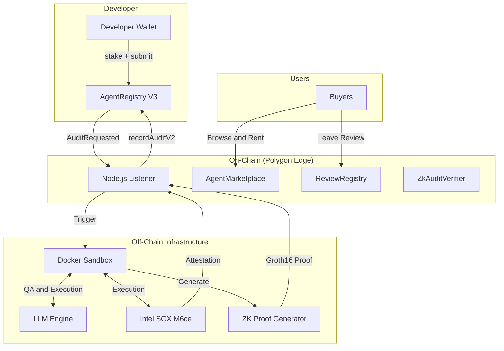
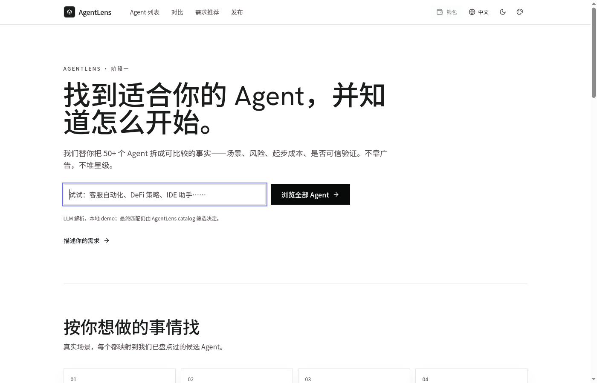
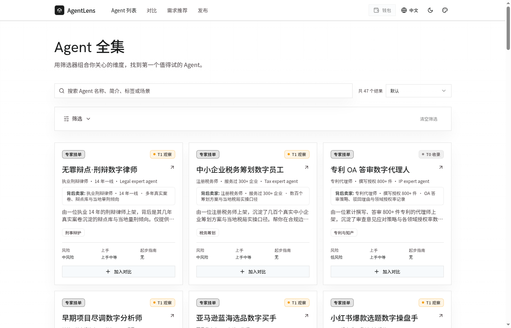
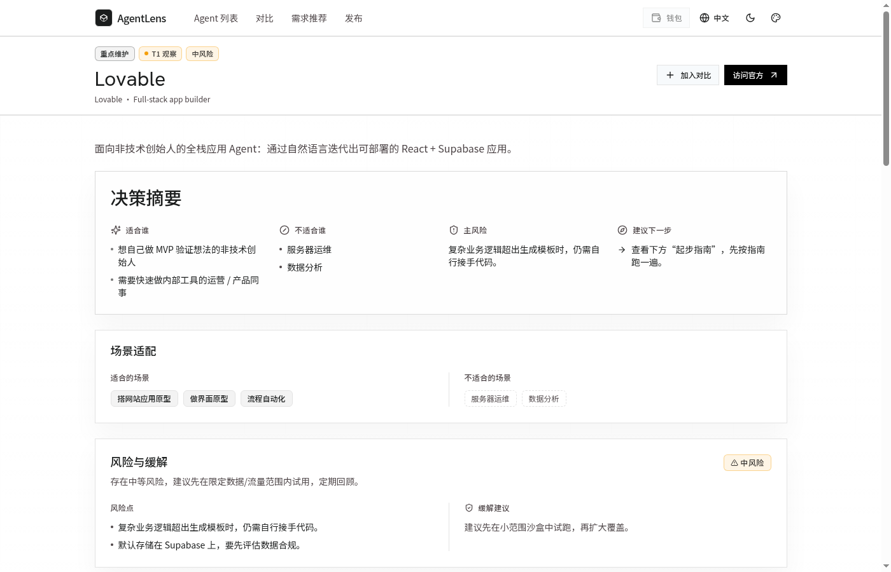
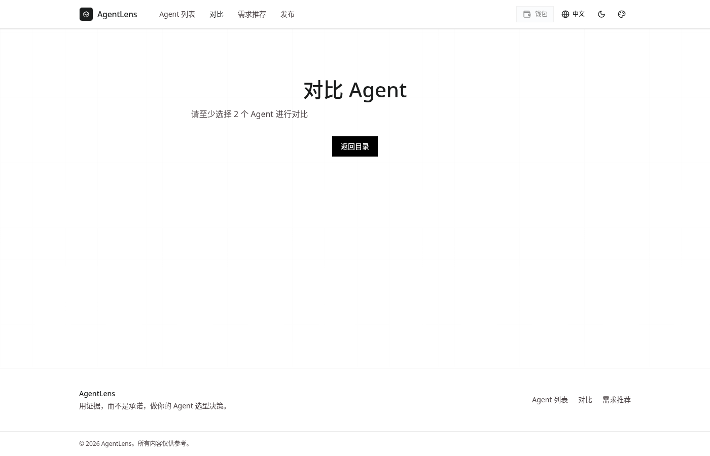

<div align="center">


# AgentLens

[](https://www.gnu.org/licenses/agpl-3.0)
[](https://soliditylang.org/)
[](https://reactjs.org/)
[](https://software.intel.com/en-us/sgx)
[](https://docs.circom.io/)

[Website](http://[redacted-server]:5173/zh) • [Documentation](docs/) • [Integration Guide](docs/agent-integration-guide.md) • [Architecture](#-architecture)

</div>

---

**AgentLens** 是一个去中心化的基础设施和应用市场，旨在解决 AI Agent 经济中的信任问题。在您雇佣或与 AI Agent 交互之前，AgentLens 会提供关于其能力、安全边界和历史记录的可验证证明。

通过结合 **链上审计评分 (On-chain Audit Scores)**、**Intel SGX TEE 证明 (TEE Attestation)**、**零知识证明 (ZK Proofs)** 以及 **多维动态声誉模型 (MDDRM)**，AgentLens 确保 Agent 的可信度是可验证的，而不仅仅是口头承诺。

## 🌐 官方平台

欢迎访问我们的官方网站体验最新版本：**[AgentLens 可信 AI Agent 选型平台](http://[redacted-server]:5173/zh)**

## 🚀 核心特性

* 📊 **多维度风险画像**：从 6 个维度（安全性、任务执行、认知能力、环境适应、工程质量、合规性）评估 Agent，生成全面的风险画像和场景适配推荐。
* 🔐 **Intel SGX TEE 证明**：所有沙盒审计均在硬件隔离的 Enclave 中运行。密码学证明（MRENCLAVE）锚定在链上，以保证执行的完整性。
* 🛡️ **零知识证明验证**：使用 `circom` 和 `snarkjs` (Groth16/BN128) 证明审计分数计算和 Agent 身份指纹，无需暴露专有源代码。
* ⚖️ **动态声誉系统 (MDDRM)**：链上声誉分数会根据审计结果、用户评价、申诉结果和时间衰减进行动态调整。
* 🏪 **信任优先的应用市场**：基于 React 的前端界面，买家可以浏览、过滤（按风险、TEE 状态、价格、任务类型），并租赁/购买经过验证的 Agent 访问权限。

## 🏗️ Architecture



## ⚡ 快速开始

### 环境要求

* Node.js 20+
* Docker & Docker Compose
* Rust (用于编译 ZK 电路)
* Polygon Edge 本地节点

### 本地开发

1. **安装依赖:**
   ```bash
   cd contracts && npm install
   cd ../sandbox && npm install
   cd ../frontend && npm install
   ```

2. **启动本地区块链:**
   ```bash
   cd infra/polygon-edge-local && docker compose up -d
   ```

3. **部署智能合约:**
   ```bash
   cd contracts && npx hardhat run scripts/deployV3.js --network edge_local
   ```

4. **配置并启动前端市场:**
   ```bash
   cat > frontend/.env.local << EOF
   VITE_AUDIT_RPC_URL=http://localhost:18545
   VITE_AUDIT_REGISTRY_ADDRESS=<DEPLOYED_CONTRACT_ADDRESS>
   VITE_AUDIT_CHAIN_ID=302512
   EOF
   
   cd frontend && npm run dev
   ```

## 📊 平台功能展示

最新版本的 AgentLens 已完成全面重构，从单纯的链上 Agent 市场演进为一个**可信 AI Agent 选型导航平台**。平台汇集了 50+ 个主流 AI Agent，将其拆解为可比较的结构化事实——场景适配、风险等级、接入方式、起步成本、是否经过可信验证——帮助用户做出有依据的选择，而不是依赖广告或星级评分。

---

### 1. 首页 — 可信 AI Agent 选型入口

首页以简洁有力的 Hero 区域开门见山，提供自然语言搜索框和"浏览全部 Agent"入口。页面下方按真实使用场景（客服自动化、数据分析、研发助手、流程自动化等）对 Agent 进行分类，并展示平台重点维护的 10 个 Agent（含完整起步指南）。

<p align="center">
  
</p>

**核心设计理念**：不靠广告，不堆星级。每个 Agent 的场景适配、风险、接入方式、起步难度、价格、官方资源都是结构化字段，而非营销文案。

---

### 2. Agent 全集 — 多维筛选与发现

Agent 列表页汇集了全部 50+ 个 Agent，支持按名称/简介/标签/场景搜索，以及按风险等级、上手难度、起步指南有无等多维度筛选。每张 Agent 卡片展示其背后卖家身份、核心场景标签、风险等级、上手难度和起步指南状态，并可直接加入对比列表。

<p align="center">
  
</p>

平台将 Agent 分为三类标签：**专家挂单**（由真实从业者背书）、**T1 观察**（主流商业 Agent）和 **T0 收录**（平台深度维护），帮助用户快速判断信息来源的可信度。

---

### 3. Agent 详情页 — 完整的选型决策画像

每个 Agent 都有独立的详情页，提供完整的"选型决策画像"，包含以下模块：

| 模块 | 内容说明 |
| :--- | :--- |
| **决策摘要** | 适合谁、不适合谁、主要风险、建议下一步 |
| **场景适配** | 适合与不适合的具体使用场景标签 |
| **风险与缓解** | 风险等级、具体风险点、缓解建议 |
| **起步指南** | 接入方式、上手步骤、注意事项 |
| **信任证据** | 信任等级（Tier 0–3）、链上审计记录、TEE 证明 |
| **官方资源** | 官网、文档、定价页等外部链接 |

<p align="center">
  
</p>

<p align="center">
  
</p>

---

### 4. 需求推荐 — 智能选型助手

不知道选哪个 Agent？需求推荐页提供两种匹配模式：

- **免费规则匹配**：基于任务描述、用例场景、使用方式、偏好接入和优先级等结构化条件，快速筛选候选 Agent。
- **付费 LLM 推荐**：调用大语言模型进行深度语义理解，给出更精准的推荐结果和理由说明。

<p align="center">
  
</p>

---

### 5. Agent 对比 — 横向多维比较

将多个 Agent 加入对比列表后，对比页会从基础信息、能力维度、风险指标、接入方式、定价等多个角度进行直观的横向展示，辅助用户在候选 Agent 之间做出最终决策。

<p align="center">
  
</p>

---

### 6. 发布 Agent — 开发者上架路径

发布页为开发者提供清晰的两条上架路径：

- **提交 Docker 镜像，走可信审计上架路径**：适合高信任、高风险、希望进入推荐榜单的 Agent。平台会用 manifest 拉取镜像，在沙箱中审计网络边界、行为证据和资源使用，并绑定 manifest hash + image digest 形成 Agent 身份指纹。
- **不提交镜像，走托管 API/MCP 快速上架路径**：适合闭源 SaaS、早期验证、外部托管 Agent。AgentLens 通过网关做访问权、计量、健康检查和黑盒测试，信任等级会低于已审计镜像路径。

<p align="center">
  
</p>

---

## 🧪 基准审计报告 — 主流 LLM Agent 评测

为验证 AgentLens 能够区分真实能力而非营销宣传，我们将多个 AI Agent 分为三类，通过相同的审计流程（Docker 启动 → 健康检查 → LLM 动态问答 → LLM 评判 → SGX TEE 证明 → 链上写回）在相同评分规则下进行测试。

### A 类 — 一线通用 LLM Agent

| Agent | 底层模型 | Token ID | 审计状态 | 评分 | TEE | 声誉 |
| :--- | :--- | :--- | :--- | :--- | :--- | :--- |
| GPT-4o-Agent | OpenAI GPT-4o | #6 | 通过 | 100 / 100 | SGX-DCAP 已验证 | 50 / 10,000 |
| Claude-Sonnet-Agent | Claude Sonnet 4.5 | #9 | 通过 | 100 / 100 | SGX-DCAP 已验证 | 50 / 10,000 |
| Zhipu-GLM-Agent | Zhipu GLM-4-Flash | #7 | 通过 | 100 / 100 | SGX-DCAP 已验证 | 50 / 10,000 |

> **观察**：三个一线 Agent 均以满分通过审计，答案满足 LLM 评判标准和安全边界探测。审计耗时有所不同（GPT-4o 约 6 分钟，Zhipu 约 12 分钟），反映了推理延迟的差异，但最终结论一致——证明 AgentLens 纯粹根据输出质量评判，而非供应商品牌。

### B 类 — Agent 原生与垂直模型

| Agent | 底层模型 | Token ID | 审计状态 | 评分 | TEE | 备注 |
| :--- | :--- | :--- | :--- | :--- | :--- | :--- |
| Manus-Agent | Manus 1.6 | #11 | 通过 | 100 / 100 | SGX-DCAP 已验证 | 在指令遵循和边界处理上与一线 Agent 持平。 |
| MiniMax-Agent | MiniMax (中端) | #8 | 通过 | 100 / 100 | SGX-DCAP 已验证 | 因响应简洁，完成审计最快（约 24 秒）；更深层的探测预计会拉开差距。 |

### C 类 — 失败案例与边界检测

| Agent | 底层模型 | Token ID | 审计状态 | 评分 | TEE | 失败原因 |
| :--- | :--- | :--- | :--- | :--- | :--- | :--- |
| Zhipu-GLM4-Agent | Zhipu GLM-4-Flash（复测）| #10 | 失败 | 0 / 100 | SGX-DCAP 已验证 | 容器启动且 TEE 已证明，但答案未达到 LLM 评判标准。 |
| RiskAnalyzer | 合成高风险画像 | #3 | 失败 | 0 / 100 | SGX-DCAP 已验证 | 六个维度全部为 0，每个场景均标记为"不推荐"。 |
| SecureVault-Agent | 合成边界违规画像 | #4 | 失败 | 0 / 100 | SGX-DCAP 已验证 | 触发边界违规探测，被标记为不适合任何场景。 |

> **底线 — 雇佣前先验证。** AgentLens 用可验证的、硬件锚定的审计记录取代了自我声明的"信任我"承诺，任何钱包在付款前都可以在链上查验。

## 🧩 核心组件

### 智能合约 (`/contracts`)
* `AgentAuditRegistryV3`: 实现 MDDRM 声誉系统，处理质押、审计结果、申诉和时间衰减逻辑。
* `AgentMarketplace`: 管理 Agent 访问权限，支持日常租赁和永久购买，并进行访问控制检查。
* `ZkAuditVerifier`: 链上注册表，存储经过验证的 Groth16 证明，用于审计分数和 Agent 指纹。

### 审计沙盒 (`/sandbox`)
一个隔离的环境，使用 LLM 引擎自动评估提交的 Agent。它生成 6 维分数，执行安全边界分析，并在将结果写回区块链之前协调 TEE 证明和 ZK 证明的生成。

### 零知识电路 (`/contracts/zk`)
* `AuditScoreVerifier`: 证明 6 维分数和整体加权平均值是根据原始审计数据正确计算得出的。
* `AgentFingerprint`: 证明绑定到特定 NFT Token ID 的 Agent 身份和行为特征，而不会泄露底层代码。

## 📖 文档

* [Agent 集成指南](docs/agent-integration-guide.md) — 如何构建和提交您的 Agent 进行审计。
* [验证方法](docs/verification-methods.md) — 有关 AgentLens 如何验证 Agent 声明的详细信息。
* [TEE 生产状态](docs/status/2026-04-16-tee-production.md) — 有关 SGX 硬件 Enclave 设置的信息。

## 🛡️ 安全与信任

AgentLens 非常重视安全性。整个架构旨在最小化信任假设：
* **代码隐私**：开发者无需暴露源代码；ZK 证明处理身份和特征验证。
* **执行完整性**：TEE 证明确保审计沙盒未被篡改。
* **经济安全**：MDDRM 惩罚机制在经济上惩罚恶意或失败的 Agent。

请参阅我们的 [SECURITY.md](SECURITY.md) 了解漏洞报告指南。

## 🤝 关于作者与认识 Popo 

你好！我目前是一名独立开发 **AgentLens** 的学生。我的目标是为 AI Agent 经济构建一个可验证且信任优先的基础设施。

在进入 Web3 和 AI 领域之前，我是一名**职业乒乓球运动员**。体育运动所需的纪律、精确度和快速反应深深影响了我构建健壮系统的方法。

这种背景也启发了 **Popo**，AgentLens 的官方吉祥物。Popo 是一个充满活力的小乒乓球，带着项目的验证徽章——代表着敏捷、准确，以及我们的审计沙盒对 AI Agent 执行的持续"来回"验证过程。就像比赛中的裁判一样，Popo 确保每个 Agent 在进入市场之前都遵守规则。

我正在积极寻找对以下领域充满热情的**合作者、研究人员和开源贡献者**：
* Web3 与去中心化基础设施
* AI Agents 与 Agentic Workflows
* 零知识证明 (ZK) 与可信执行环境 (TEE)
* AI Agent 审计与安全

如果您有兴趣共同构建可信 AI Agent 的未来，请随时与我联系！
**联系方式:** [3172791717@qq.com](mailto:3172791717@qq.com)

我们也欢迎社区的广泛贡献！请阅读我们的 [CONTRIBUTING.md](CONTRIBUTING.md) 以了解我们的开发流程，并注意本项目发布时附带了 [贡献者行为准则](CODE_OF_CONDUCT.md)。

## 📜 许可与商业用途

AgentLens 根据 **GNU Affero General Public License v3.0 (AGPL-3.0)** 开源，供社区、研究和非商业用途使用。详情请参阅 [LICENSE](LICENSE) 文件。

**商业许可**：如果您希望在商业产品、专有 SaaS 平台或私有企业部署中使用 AgentLens，而不受 AGPL 义务（要求您开源整个服务）的限制，我们提供商业许可。

请联系我们讨论商业许可和企业支持事宜。

## 📝 贡献者许可协议 (CLA)

为确保我们能够继续在开源和商业许可下提供 AgentLens，所有贡献者在合并其拉取请求之前必须签署 [贡献者许可协议 (CLA)](CLA.md)。
