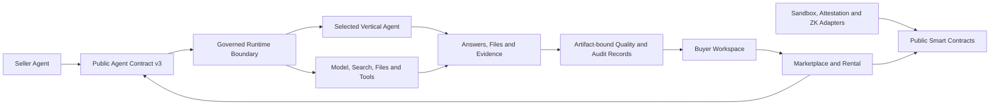

<div align="center">


# AgentLens

[](https://www.gnu.org/licenses/agpl-3.0)
[](https://soliditylang.org/)
[](https://react.dev/)
[](docs/protocols/README.md)

## [Open AgentLens](https://agentlens.chat/en)

[Live Platform](https://agentlens.chat/en) • [Public Protocols](docs/protocols/README.md) • [Integration Guide](docs/agent-integration-guide.md) • [Security](SECURITY.md) • [中文](README_CN.md)

</div>

---

**AgentLens** is a trust-first AI Agent marketplace and workspace. Users can discover task-specific Agents, compare evidence and execution boundaries, rent a supported Agent, and run it with platform-provided model, search, file, artifact and audit capabilities.

The platform follows a simple boundary: **AgentLens provides the brain and governed runtime; sellers provide the specialized Agent.** Renting an Agent grants time-limited execution access. It does not transfer source code or permanent ownership.

> This repository is the sanitized public source distribution. It contains the public product surface, contracts, integration schemas and non-sensitive audit reference code. Hosted Brain strategies, production routing, Workers, capability-broker policy, quality scoring, billing ledgers, credentials, topology and deployment automation remain private.

## What Is Public

- **Marketplace and decision UI**: browse, compare, inspect trust evidence and understand how an Agent can be used.
- **Rental-only smart contracts**: time-limited access, reviews, audit records, appeals and reputation primitives.
- **Audit reference implementation**: six-dimensional evaluation, evidence persistence, attestation adapters and ZK verification components.
- **Agent Contract v3 and Wire v1**: tasks, streaming events, tools, checkpoints, cancellation, resume, artifacts and structured failures.
- **Provider contracts**: normalized model, search, research bundle, source map and conformance records.
- **Runtime contracts**: immutable packages, capability grants and R0-R4 execution-plane descriptions.

Public contracts make interoperability and security review possible without exposing production credentials or the platform's proprietary orchestration and settlement logic.

## Architecture



The diagram describes public trust boundaries, not the production network topology.

## Runtime Contract Coverage

| Level | Plane | Purpose | Availability statement |
|---|---|---|---|
| R0 | `sealed_ephemeral` | Isolated, short-lived file and artifact tasks | Base contract |
| R1 | `brokered_egress` | Governed HTTP, search and connector access | Permission and budget controlled |
| R2 | `durable_session` | Checkpoints, resume, persistent volumes and long jobs | Lifecycle metered |
| R3 | `browser_computer` | Read-only or interactive browser sessions | Separately isolated and approved |
| R4 | `accelerated_external` | GPU, special OS and very large storage | Reserved; extreme workloads are currently deferred |

A schema can describe a capability without promising that every deployment supplies it. An Agent must pass runtime conformance before listing; unsupported capabilities fail closed rather than silently degrading.

## Quick Start

### Requirements

- Node.js 20+
- npm 10+
- Docker only for container audit exercises

### Install and verify

```bash
git clone https://github.com/ZhangJinHaHaHa/AgentLens.git
cd AgentLens

cd contracts && npm install && npm test
cd ../sandbox && npm install && npm test
cd ../frontend && npm install && npm test && npm run build
```

### Run the public frontend locally

```bash
cd frontend
npm run dev
```

The public UI can be explored without production secrets. Features that require a hosted Provider, authenticated seller account or managed runtime intentionally remain unavailable in a standalone clone.

## Product Surface

### Discover and compare Agents

The catalog separates runnable marketplace Agents from external AI tool guidance. Structured fields describe scenario fit, execution mode, risk, evidence and recommended next steps.

<p align="center">
  
</p>

### Inspect trust and runtime boundaries

Agent detail pages distinguish platform-native audited execution, seller-hosted APIs and external handoff. A recognized listing is not automatically a sandbox guarantee.

<p align="center">
  
</p>

### Publish through explicit paths

Sellers can submit code artifacts for platform processing or register a seller-hosted HTTPS API. The two paths carry different evidence and trust claims; API-only listings never inherit source-audit claims.

<p align="center">
  
</p>

## Public Integration Contracts

The machine-readable contracts live in [`docs/protocols/schemas`](docs/protocols/schemas):

- Agent Contract v3, Agent Wire v1 and immutable Runtime Package v1
- Universal Runtime planes, capability grants and external resource receipts
- Model Provider, content-part and conformance contracts
- Search Provider and Research Bundle v3
- Artifact-to-source mapping
- Seller submission, hosted runtime, market listing and pricing quote

See the [protocol index](docs/protocols/README.md) for versioning, credential boundaries, R0-R4 semantics and rental accounting.

## Security and Evidence

- Platform and seller credentials must remain server-side and must never appear in Wire frames, browser bundles, traces or artifacts.
- Submitted endpoints and network calls require SSRF-resistant validation, resolved-address checks, timeouts, response limits and authorization.
- Audit evidence is bound to versions and content hashes. Optional TEE or ZK adapters can strengthen a record, but their presence must be verified per record and must not be inferred from a generic listing.
- Historical or mock attestations are not production hardware claims.
- Seller QA is input evidence, not proof of marketplace quality; platform quality records must identify the target artifact and runtime version.

Please report vulnerabilities privately as described in [SECURITY.md](SECURITY.md). Do not publish exploit details before a fix is available.

## Repository Boundary

| Included here | Kept in the private hosted service |
|---|---|
| Public frontend and catalog | Workspace control plane and private admin surfaces |
| Smart contracts and ABIs | Production addresses, signers and chain operations |
| Protocol schemas and OpenAPI | Brain prompts, routing algorithms and Provider weights |
| Non-sensitive sandbox and verification code | Production Workers, queues and capability-broker implementation |
| Local tests and conformance fixtures | QA scoring internals, billing ledger and settlement reconciliation |
| Generic integration documentation | Infrastructure topology, deployment scripts, secrets and runtime state |

This boundary is deliberate: third-party Agents get a stable, reviewable contract while the platform's operational security and core orchestration remain protected.

## Documentation

- [Public Integration Contracts](docs/protocols/README.md)
- [Agent Integration Guide](docs/agent-integration-guide.md)
- [Verification Methods](docs/verification-methods.md)
- [Security Policy](SECURITY.md)
- [Contributing](CONTRIBUTING.md)

## License and Contributions

AgentLens is licensed under the **GNU Affero General Public License v3.0 (AGPL-3.0)**. Network deployments of modified AGPL code must comply with the corresponding-source obligations in the [license](LICENSE). Commercial licensing for proprietary use may be discussed with the repository owner.

Contributors must follow the [Code of Conduct](CODE_OF_CONDUCT.md) and sign the [Contributor License Agreement](CLA.md) before a pull request is merged.

<div align="center">

Built by the AgentLens project.

[Open AgentLens](https://agentlens.chat/en) • [GitHub](https://github.com/ZhangJinHaHaHa/AgentLens) • [Security](SECURITY.md)

</div>
