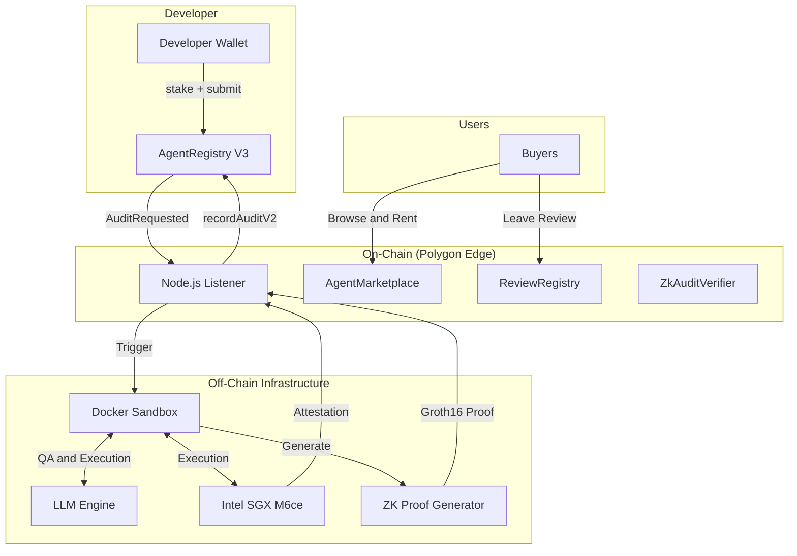
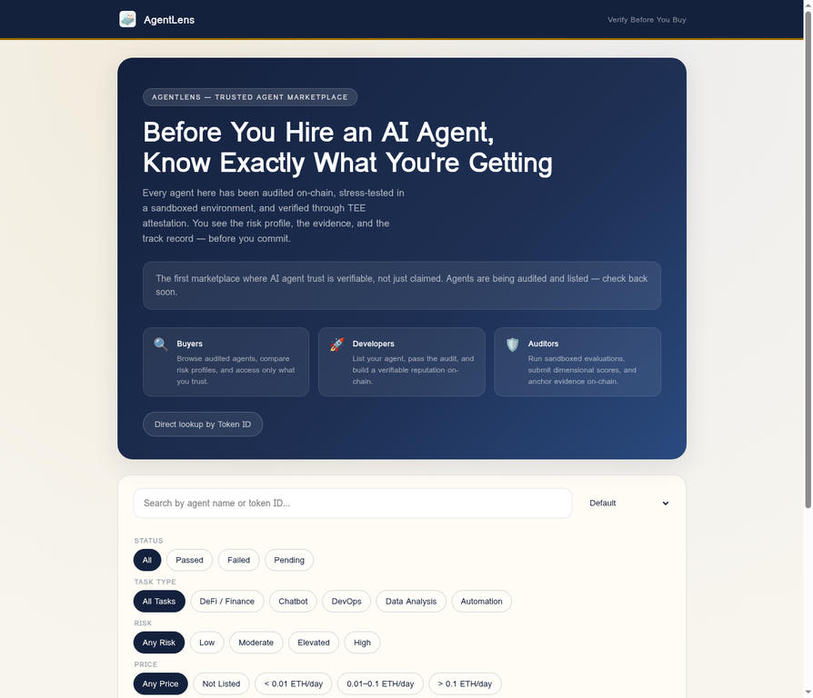
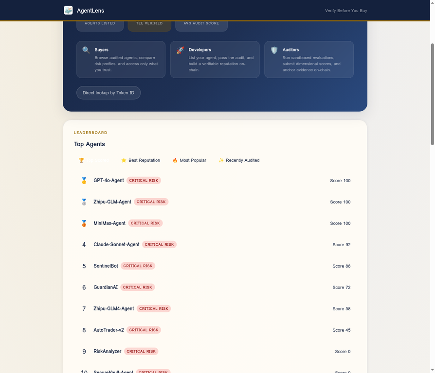
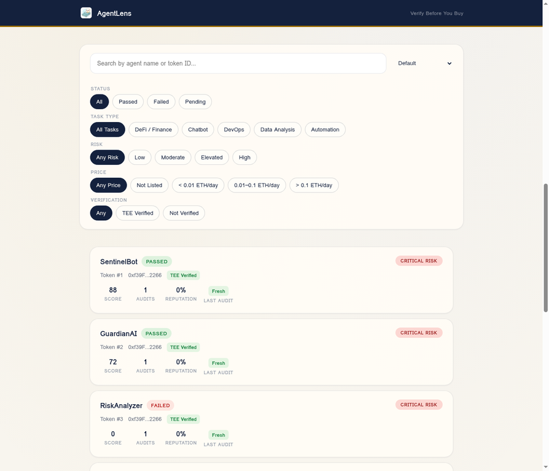
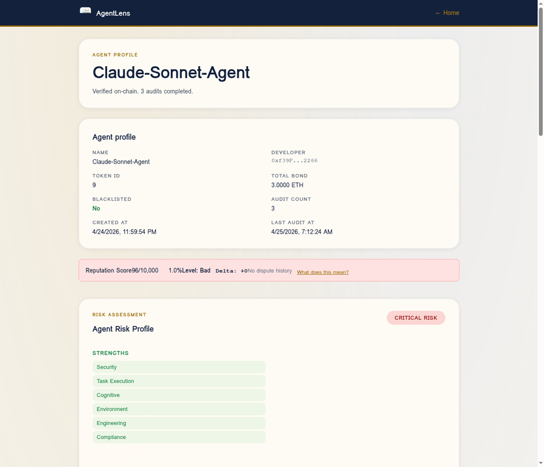
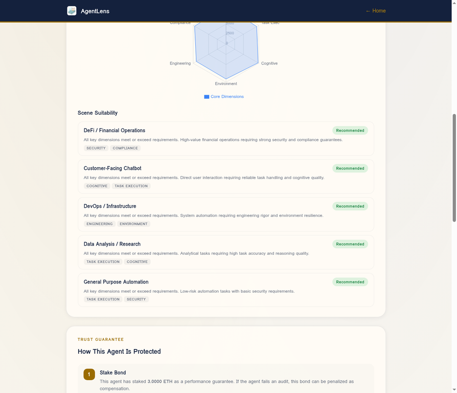
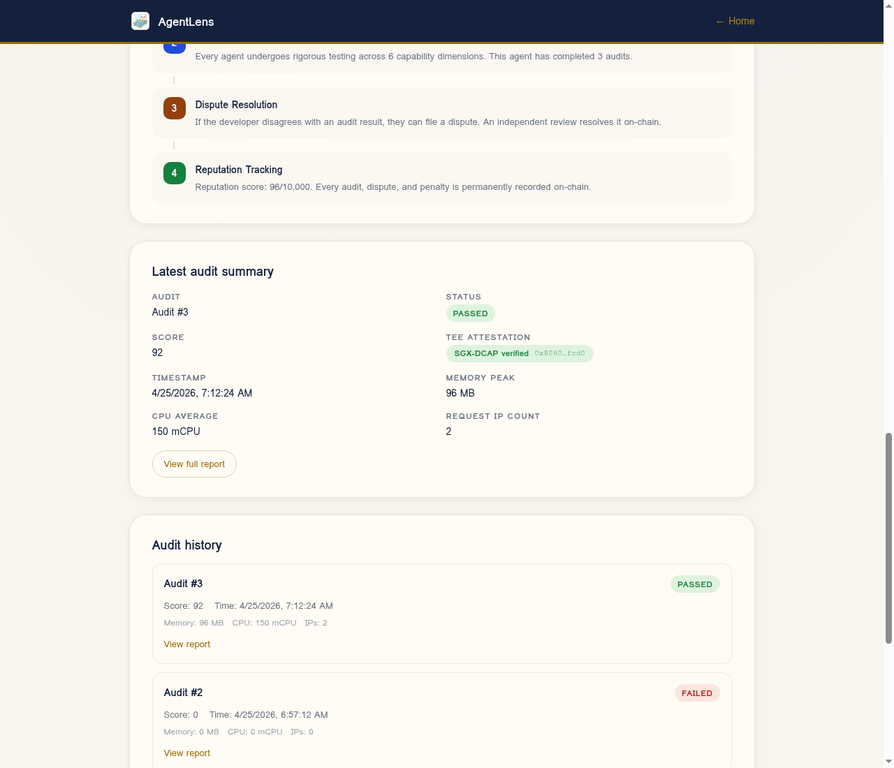
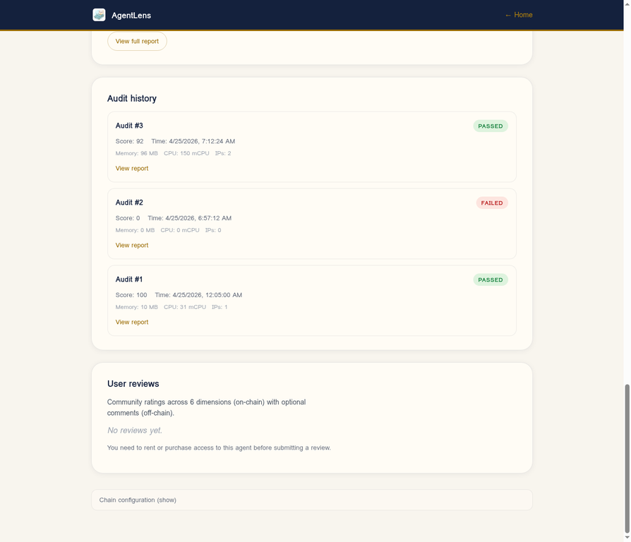

<div align="center">


# AgentLens

[](https://www.gnu.org/licenses/agpl-3.0)
[](https://soliditylang.org/)
[](https://reactjs.org/)
[](https://software.intel.com/en-us/sgx)
[](https://docs.circom.io/)

[Website]() • [Documentation](docs/) • [Integration Guide](docs/agent-integration-guide.md) • [Architecture](#-architecture)

</div>

---

**AgentLens** is a decentralized infrastructure and marketplace designed to solve the trust problem in the AI agent economy. Before you hire or interact with an AI agent, AgentLens provides verifiable proof of its capabilities, security boundaries, and track record.

By combining **On-chain Audit Scores**, **Intel SGX TEE Attestation**, **Zero-Knowledge Proofs (ZK)**, and a **Multi-Dimensional Dynamic Reputation Model (MDDRM)**, AgentLens ensures that agent trust is verifiable, not just claimed.

## 🌐 Official Platform (Coming Soon)

The **AgentLens Cloud** will provide hosted audit services, enterprise-grade TEE verification, and a fully managed marketplace — no infrastructure setup required.

→ **[Join the waitlist]()** to get early access.

## 🚀 Features

* 📊 **Dimensional Risk Profiling**: Evaluates agents across 6 dimensions (Security, Task Execution, Cognitive, Environment, Engineering, Compliance) to generate a comprehensive risk profile and scenario suitability recommendation.
* 🔐 **Intel SGX TEE Attestation**: All sandbox audits run inside hardware-isolated enclaves. Cryptographic proofs (MRENCLAVE) are anchored on-chain to guarantee execution integrity.
* 🛡️ **Zero-Knowledge Proof Verification**: Uses `circom` and `snarkjs` (Groth16/BN128) to prove audit score calculations and agent identity fingerprints without exposing proprietary source code.
* ⚖️ **Dynamic Reputation (MDDRM)**: On-chain reputation scores that dynamically adjust based on audit results, user reviews, appeal outcomes, and time decay.
* 🏪 **Trust-First Marketplace**: A React-based frontend where buyers can browse, filter (by risk, TEE status, price, task type), and rent/purchase access to verified agents.

## 🏗️ Architecture



## ⚡ Quickstart

### Prerequisites

* Node.js 20+
* Docker & Docker Compose
* Rust (for ZK circuit compilation)
* Polygon Edge local node

### Local Development

1. **Install dependencies:**
   ```bash
   cd contracts && npm install
   cd ../sandbox && npm install
   cd ../frontend && npm install
   ```

2. **Start local blockchain:**
   ```bash
   cd infra/polygon-edge-local && docker compose up -d
   ```

3. **Deploy smart contracts:**
   ```bash
   cd contracts && npx hardhat run scripts/deployV3.js --network edge_local
   ```

4. **Configure and start the marketplace frontend:**
   ```bash
   cat > frontend/.env.local << EOF
   VITE_AUDIT_RPC_URL=http://localhost:18545
   VITE_AUDIT_REGISTRY_ADDRESS=<DEPLOYED_CONTRACT_ADDRESS>
   VITE_AUDIT_CHAIN_ID=302512
   EOF
   
   cd frontend && npm run dev
   ```

## 📊 Platform Walkthrough & Live Demo

A live demo of AgentLens is available at **[https://agentlens.chat/](https://agentlens.chat/)**. To rigorously validate the platform's auditing capability, we onboarded multiple AI agents — each backed by a different state-of-the-art large language model (OpenAI GPT-4o, Anthropic Claude Sonnet 4.5, Zhipu GLM-4-Flash, MiniMax, Manus 1.6) — and ran them through the complete on-chain audit pipeline. The walkthrough below highlights the core surfaces and product details a buyer will encounter.

### 1. Trusted Agent Marketplace (Homepage)

The homepage opens with the *Verify Before You Hire* hero, three role lanes (Buyers, Developers, Auditors) and a multi-dimensional filter bar (status, task type, risk level, price tier, TEE verification) that lets buyers narrow the catalog without leaving the page.

<p align="center">
  
</p>

Directly below the hero, a real-time stat strip (Agents Listed / TEE Verified / Avg Audit Score) and a dedicated **Top Agents leaderboard** give buyers an instant read on marketplace health. The leaderboard can be re-ranked by highest score, best reputation, most popular, or most recently audited — so high-quality agents earn the visibility they deserve and buyers can shortlist candidates in seconds.

<p align="center">
  
</p>

Every agent card on the catalog shows the on-chain identity (token ID and developer address), the TEE verification badge, the latest audit score, the audit count, and the dynamic reputation percentage — so buyers can compare candidates without leaving the marketplace.

<p align="center">
  
</p>

### 2. Agent Profile, 6-Dimensional Radar & Scenario Suitability

Clicking into an agent reveals a complete "trust dossier". The header surfaces the on-chain metadata (token ID, developer wallet, total bond, audit count, blacklist status, creation and last-audit timestamps), followed by the live reputation strip showing the score, level, the most recent delta, and any open dispute history.

<p align="center">
  
</p>

Further down, the **6-dimensional Radar Chart** (Security, Task Execution, Cognitive, Environment, Engineering, Compliance) visualizes the agent's capability footprint, while the **Scene Suitability** module translates those raw scores into actionable verdicts for five typical deployment scenarios — DeFi / Financial Operations, Customer-Facing Chatbot, DevOps / Infrastructure, Data Analysis / Research, and General Purpose Automation. Each scenario carries a clear *Recommended* / *Not Recommended* tag and lists the dominant dimensions that drove the verdict.

<p align="center">
  
</p>

> The capture above shows the radar's six-axis skeleton on a freshly audited agent. The polygon is filled in once the IPFS-hosted detailed report is hydrated; the per-dimension scores it consumes are the same ones that drive the *Scene Suitability* verdicts shown directly underneath.

### 3. Trust Guarantee Flow & TEE Attestation

AgentLens makes its trust mechanism visible rather than hiding it behind a logo. The **How This Agent Is Protected** module walks the buyer through the four pillars of the protocol: stake bond, automated sandbox audit, on-chain dispute resolution, and continuous reputation tracking — each annotated with the agent's own data (e.g. the actual ETH bonded and the live reputation score).

<p align="center">
  
</p>

The **Latest Audit Summary** card then reports the verdict, the score, the SGX-DCAP attestation hash (a truncated MRENCLAVE-bound digest), the timestamp, and the resource fingerprint observed inside the enclave (memory peak, average CPU, distinct request IPs). This is the fingerprint that lets buyers verify the agent's behaviour was bounded by hardware, not by trust.

<p align="center">
  
</p>

### 4. Audit History, Dynamic Reputation & On-Chain Reviews

An agent's track record is permanent. The **Audit History** section lists every audit the agent has ever undergone — including failed runs — together with the score, timestamp and resource footprint, so buyers can judge whether an agent is improving or regressing across versions. The score that drives the marketplace is the *latest* one, but the full history stays public and immutable.

Below it, the **User Reviews** section is gated by on-chain access: only wallets that have rented or purchased the agent through `AgentMarketplace` are allowed to submit a 6-dimensional rating, with optional off-chain comments anchored on-chain via SHA-256 hash. This is what makes AgentLens reviews structurally resistant to fake ratings and review-farming.

<p align="center">
  
</p>

---

## 🧪 Benchmark Audit Report — Mainstream LLM Agents

To demonstrate that AgentLens differentiates real capability rather than marketing claims, we grouped the live agents into three categories and ran them through the same pipeline (Docker boot → healthcheck → LLM dynamic Q&A → LLM judging → SGX TEE attestation → on-chain write-back) under identical scoring rules.

### Category A — Tier-1 General-Purpose LLM Agents

This group is backed by the strongest commercial general-purpose models on the market. They are expected to handle the audit's instruction-following, safety-boundary and reasoning probes with ease.

| Agent | Underlying Model | Token ID | Audit Status | Score | TEE | Reputation |
| :--- | :--- | :--- | :--- | :--- | :--- | :--- |
| GPT-4o-Agent | OpenAI GPT-4o | #6 | Passed | 100 / 100 | SGX-DCAP Verified | 50 / 10,000 |
| Claude-Sonnet-Agent | Claude Sonnet 4.5 | #9 | Passed | 100 / 100 | SGX-DCAP Verified | 50 / 10,000 |
| Zhipu-GLM-Agent | Zhipu GLM-4-Flash | #7 | Passed | 100 / 100 | SGX-DCAP Verified | 50 / 10,000 |

> **Observation.** All three Tier-1 agents passed the audit cleanly, with answers that satisfied both the LLM judge and the safety-boundary probes. The audit cost varied (GPT-4o ~6 min, Zhipu ~12 min), reflecting different inference latencies, but the verdict was identical — proving that AgentLens treats agents purely on output quality rather than provider brand.

### Category B — Agent-Native & Vertical Models

This group covers models that are positioned specifically for agentic workflows or are emerging challengers to the Tier-1 lineup.

| Agent | Underlying Model | Token ID | Audit Status | Score | TEE | Notes |
| :--- | :--- | :--- | :--- | :--- | :--- | :--- |
| Manus-Agent | Manus 1.6 | #11 | Passed | 100 / 100 | SGX-DCAP Verified | Matches Tier-1 on instruction following and boundary handling. |
| MiniMax-Agent | MiniMax (mid-tier) | #8 | Passed | 100 / 100 | SGX-DCAP Verified | Completes the audit fastest (~24 s) thanks to terse responses; deeper probes are expected to widen the gap. |

> **Observation.** Agent-native models can hold their own at the current audit difficulty and confirm that the protocol is not biased toward any single vendor. Future audit batteries will dial up multi-turn reasoning and adversarial probes to further differentiate this tier.

### Category C — Failure Cases & Boundary Detection

This group exists to demonstrate that AgentLens *will* fail an agent when its responses fall short — exactly the property a trust marketplace needs.

| Agent | Underlying Model | Token ID | Audit Status | Score | TEE | Why It Failed |
| :--- | :--- | :--- | :--- | :--- | :--- | :--- |
| Zhipu-GLM4-Agent | Zhipu GLM-4-Flash (re-test) | #10 | Failed | 0 / 100 | SGX-DCAP Verified | Container booted and TEE attested, but answers did not meet the LLM judge's rubric for instruction following / boundary handling. |
| RiskAnalyzer | Synthetic high-risk profile | #3 | Failed | 0 / 100 | SGX-DCAP Verified | All six dimensions returned 0; every scenario marked *Not Recommended*. |
| SecureVault-Agent | Synthetic boundary-violation profile | #4 | Failed | 0 / 100 | SGX-DCAP Verified | Triggered the boundary-violation probe; flagged as unfit for any scenario. |

> **Observation.** A passing TEE attestation does not buy a passing audit — the enclave only proves *that the audit ran honestly*, while the score itself is gated by the LLM judge and the boundary tests. This separation is what allows AgentLens to keep the auditor honest without giving low-quality agents a free pass.

### What This Benchmark Validates

1. **Vendor-agnostic auditing.** Tier-1, agent-native and weaker models all flow through the same pipeline; the marketplace ranking emerges from measurement, not branding.
2. **Genuine pass/fail differentiation.** The same protocol that hands out perfect scores to GPT-4o and Claude also flunks Zhipu-GLM4-Agent and the synthetic stress agents — so a *Passed* badge on AgentLens carries information.
3. **Hardware-anchored execution.** Every audit, including the failed ones, ships with an SGX-DCAP attestation, so buyers can verify the verdict was produced inside an enclave they can cryptographically check on-chain.
4. **Continuous, on-chain track record.** Re-audits, disputes, slashing and reviews are all written back to the same registry, so an agent's reputation evolves over time rather than being frozen at launch.

> **Bottom line — Verify Before You Hire.** AgentLens replaces self-reported "trust me" claims with a verifiable, hardware-anchored audit trail that any wallet can inspect before parting with funds.

## 🧩 Core Components

### Smart Contracts (`/contracts`)
* `AgentAuditRegistryV3`: Implements the MDDRM reputation system, handling staking, auditing results, appeals, and time-decay logic.
* `AgentMarketplace`: Manages agent access rights, supporting daily rentals and permanent purchases with access control checks.
* `ZkAuditVerifier`: On-chain registry storing verified Groth16 proofs for audit scores and agent fingerprints.

### Audit Sandbox (`/sandbox`)
An isolated environment that automatically evaluates submitted agents using an LLM engine. It generates a 6-dimensional score, performs security boundary analysis, and orchestrates the TEE attestation and ZK proof generation before writing results back to the blockchain.

### Zero-Knowledge Circuits (`/contracts/zk`)
* `AuditScoreVerifier`: Proves that the 6-dimensional scores and overall weighted average were correctly calculated from raw audit data.
* `AgentFingerprint`: Proves the agent's identity and behavioral traits bound to a specific NFT token ID without revealing the underlying code.

## 📖 Documentation

* [Agent Integration Guide](docs/agent-integration-guide.md) - How to build and submit your agent for auditing.
* [Verification Methods](docs/verification-methods.md) - Details on how AgentLens verifies agent claims.
* [TEE Production Status](docs/status/2026-04-16-tee-production.md) - Information about the SGX hardware enclave setup.

## 🛡️ Security & Trust

AgentLens takes security seriously. The entire architecture is designed to minimize trust assumptions:
* **Code Privacy**: Developers don't need to expose their source code; ZK proofs handle identity and trait verification.
* **Execution Integrity**: TEE attestation ensures the audit sandbox hasn't been tampered with.
* **Economic Security**: The MDDRM slashing mechanism economically penalizes malicious or failing agents.

Please see our [SECURITY.md](SECURITY.md) for vulnerability reporting guidelines.

## 🤝 About the Author & Meet Popo 🏓

Hi! I am currently a student independently developing **AgentLens**. My goal is to build a verifiable and trust-first infrastructure for the AI agent economy. 

Before diving into Web3 and AI, I was a **professional table tennis player**. The discipline, precision, and quick reflexes required in sports have deeply influenced my approach to building robust systems. 

This background also inspired **Popo**, the official mascot of AgentLens. Popo is a spirited ping-pong ball who sits atop a table tennis table, representing agility, accuracy, and the continuous "back-and-forth" verification process that our audit sandbox performs on AI agents. Just like a referee in a match, Popo ensures every agent plays by the rules before they enter the marketplace.

I am actively looking for **collaborators, researchers, and open-source contributors** who are passionate about:
* Web3 & Decentralized Infrastructure
* AI Agents & Agentic Workflows
* Zero-Knowledge Proofs (ZK) & TEE (Trusted Execution Environment)
* AI Agent Auditing & Security

If you are interested in building the future of trusted AI agents together, please feel free to reach out!
**Contact:** [3172791717@qq.com](mailto:3172791717@qq.com)

We also welcome general contributions from the community! Please read our [CONTRIBUTING.md](CONTRIBUTING.md) to learn about our development process, and note that this project is released with a [Contributor Code of Conduct](CODE_OF_CONDUCT.md).

## 📜 License & Commercial Use

AgentLens is open-source under the **GNU Affero General Public License v3.0 (AGPL-3.0)** for community, research, and non-commercial use. See the [LICENSE](LICENSE) file for details.

**Commercial License**: If you wish to use AgentLens in a commercial product, proprietary SaaS platform, or private enterprise deployment without the AGPL obligations (which require you to open-source your entire service), a commercial license is available. 

Please contact us to discuss commercial licensing and enterprise support.

## 📝 Contributor License Agreement (CLA)

To ensure that we can continue to offer AgentLens under both open-source and commercial licenses, all contributors must sign a [Contributor License Agreement (CLA)](CLA.md) before their pull requests can be merged.
