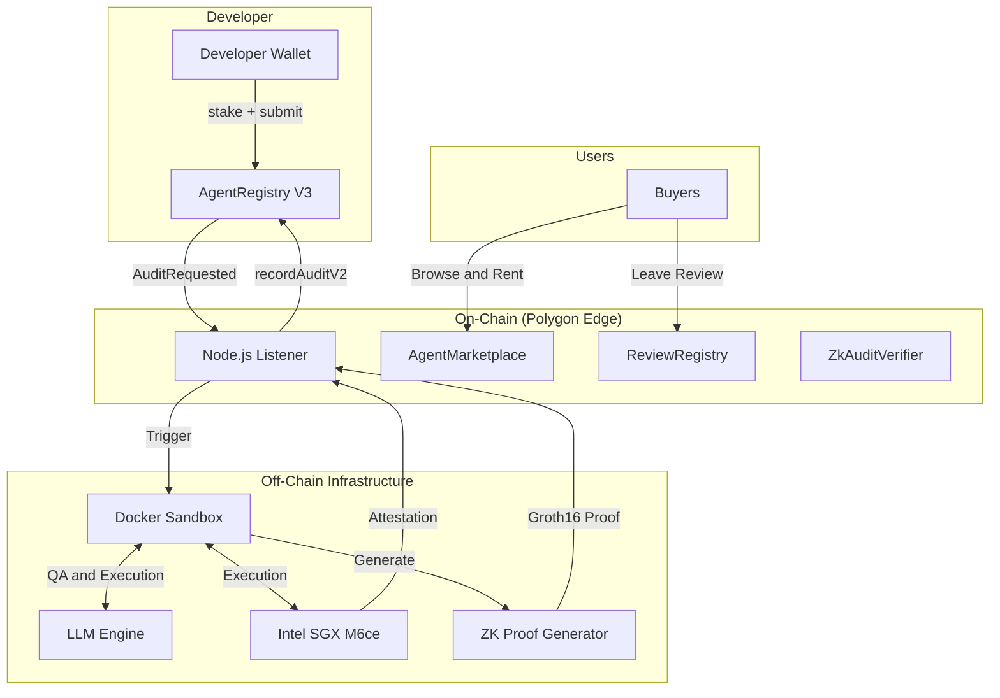

<div align="center">


# AgentLens

[](https://www.gnu.org/licenses/agpl-3.0)
[](https://soliditylang.org/)
[](https://reactjs.org/)
[](https://software.intel.com/en-us/sgx)
[](https://docs.circom.io/)

[Website]() • [Documentation](docs/) • [Integration Guide](docs/agent-integration-guide.md) • [Architecture](#-architecture)

</div>

---

**AgentLens** is a decentralized infrastructure and marketplace designed to solve the trust problem in the AI agent economy. Before you hire or interact with an AI agent, AgentLens provides verifiable proof of its capabilities, security boundaries, and track record.

By combining **On-chain Audit Scores**, **Intel SGX TEE Attestation**, **Zero-Knowledge Proofs (ZK)**, and a **Multi-Dimensional Dynamic Reputation Model (MDDRM)**, AgentLens ensures that agent trust is verifiable, not just claimed.

## 🌐 Official Platform (Coming Soon)

The **AgentLens Cloud** will provide hosted audit services, enterprise-grade TEE verification, and a fully managed marketplace — no infrastructure setup required.

→ **[Join the waitlist]()** to get early access.

## 🚀 Features

* 📊 **Dimensional Risk Profiling**: Evaluates agents across 6 dimensions (Security, Task Execution, Cognitive, Environment, Engineering, Compliance) to generate a comprehensive risk profile and scenario suitability recommendation.
* 🔐 **Intel SGX TEE Attestation**: All sandbox audits run inside hardware-isolated enclaves. Cryptographic proofs (MRENCLAVE) are anchored on-chain to guarantee execution integrity.
* 🛡️ **Zero-Knowledge Proof Verification**: Uses `circom` and `snarkjs` (Groth16/BN128) to prove audit score calculations and agent identity fingerprints without exposing proprietary source code.
* ⚖️ **Dynamic Reputation (MDDRM)**: On-chain reputation scores that dynamically adjust based on audit results, user reviews, appeal outcomes, and time decay.
* 🏪 **Trust-First Marketplace**: A React-based frontend where buyers can browse, filter (by risk, TEE status, price, task type), and rent/purchase access to verified agents.

## 🏗️ Architecture



## ⚡ Quickstart

### Prerequisites

* Node.js 20+
* Docker & Docker Compose
* Rust (for ZK circuit compilation)
* Polygon Edge local node

### Local Development

1. **Install dependencies:**
   ```bash
   cd contracts && npm install
   cd ../sandbox && npm install
   cd ../frontend && npm install
   ```

2. **Start local blockchain:**
   ```bash
   cd infra/polygon-edge-local && docker compose up -d
   ```

3. **Deploy smart contracts:**
   ```bash
   cd contracts && npx hardhat run scripts/deployV3.js --network edge_local
   ```

4. **Configure and start the marketplace frontend:**
   ```bash
   cat > frontend/.env.local << EOF
   VITE_AUDIT_RPC_URL=http://localhost:18545
   VITE_AUDIT_REGISTRY_ADDRESS=<DEPLOYED_CONTRACT_ADDRESS>
   VITE_AUDIT_CHAIN_ID=302512
   EOF
   
   cd frontend && npm run dev
   ```

## 🧩 Core Components

### Smart Contracts (`/contracts`)
* `AgentAuditRegistryV3`: Implements the MDDRM reputation system, handling staking, auditing results, appeals, and time-decay logic.
* `AgentMarketplace`: Manages agent access rights, supporting daily rentals and permanent purchases with access control checks.
* `ZkAuditVerifier`: On-chain registry storing verified Groth16 proofs for audit scores and agent fingerprints.

### Audit Sandbox (`/sandbox`)
An isolated environment that automatically evaluates submitted agents using an LLM engine. It generates a 6-dimensional score, performs security boundary analysis, and orchestrates the TEE attestation and ZK proof generation before writing results back to the blockchain.

### Zero-Knowledge Circuits (`/contracts/zk`)
* `AuditScoreVerifier`: Proves that the 6-dimensional scores and overall weighted average were correctly calculated from raw audit data.
* `AgentFingerprint`: Proves the agent's identity and behavioral traits bound to a specific NFT token ID without revealing the underlying code.

## 📖 Documentation

* [Agent Integration Guide](docs/agent-integration-guide.md) - How to build and submit your agent for auditing.
* [Verification Methods](docs/verification-methods.md) - Details on how AgentLens verifies agent claims.
* [TEE Production Status](docs/status/2026-04-16-tee-production.md) - Information about the SGX hardware enclave setup.

## 🛡️ Security & Trust

AgentLens takes security seriously. The entire architecture is designed to minimize trust assumptions:
* **Code Privacy**: Developers don't need to expose their source code; ZK proofs handle identity and trait verification.
* **Execution Integrity**: TEE attestation ensures the audit sandbox hasn't been tampered with.
* **Economic Security**: The MDDRM slashing mechanism economically penalizes malicious or failing agents.

Please see our [SECURITY.md](SECURITY.md) for vulnerability reporting guidelines.

## 🤝 About the Author & Meet Popo 🏓

Hi! I am currently a student independently developing **AgentLens**. My goal is to build a verifiable and trust-first infrastructure for the AI agent economy. 

Before diving into Web3 and AI, I was a **professional table tennis player**. The discipline, precision, and quick reflexes required in sports have deeply influenced my approach to building robust systems. 

This background also inspired **Popo**, the official mascot of AgentLens. Popo is a spirited ping-pong ball sitting atop a table tennis table. 

But Popo is more than just a referee—it is the **symbol of the platform's flywheel**. In table tennis, a ball represents continuous, high-speed "two-way flow" between two sides. Similarly, AgentLens operates as a **two-sided trust hub**: the "Dark Side" provides essential infrastructure (sandboxes, MCP gateways, payment rails) to attract and capture AI agents, while the "Light Side" offers a marketplace where human users can hire these verified agents with confidence. 

Popo is the messenger connecting these two worlds. Every time an agent uses our infrastructure, data flows back and forth like a ping-pong ball, transforming into verifiable trust that powers the entire Agent Economy.

I am actively looking for **collaborators, researchers, and open-source contributors** who are passionate about:
* Web3 & Decentralized Infrastructure
* AI Agents & Agentic Workflows
* Zero-Knowledge Proofs (ZK) & TEE (Trusted Execution Environment)
* AI Agent Auditing & Security

If you are interested in building the future of trusted AI agents together, please feel free to reach out!
**Contact:** [3172791717@qq.com](mailto:3172791717@qq.com)

We also welcome general contributions from the community! Please read our [CONTRIBUTING.md](CONTRIBUTING.md) to learn about our development process, and note that this project is released with a [Contributor Code of Conduct](CODE_OF_CONDUCT.md).

## 📜 License & Commercial Use

AgentLens is open-source under the **GNU Affero General Public License v3.0 (AGPL-3.0)** for community, research, and non-commercial use. See the [LICENSE](LICENSE) file for details.

**Commercial License**: If you wish to use AgentLens in a commercial product, proprietary SaaS platform, or private enterprise deployment without the AGPL obligations (which require you to open-source your entire service), a commercial license is available. 

Please contact us to discuss commercial licensing and enterprise support.

## 📝 Contributor License Agreement (CLA)

To ensure that we can continue to offer AgentLens under both open-source and commercial licenses, all contributors must sign a [Contributor License Agreement (CLA)](CLA.md) before their pull requests can be merged.
