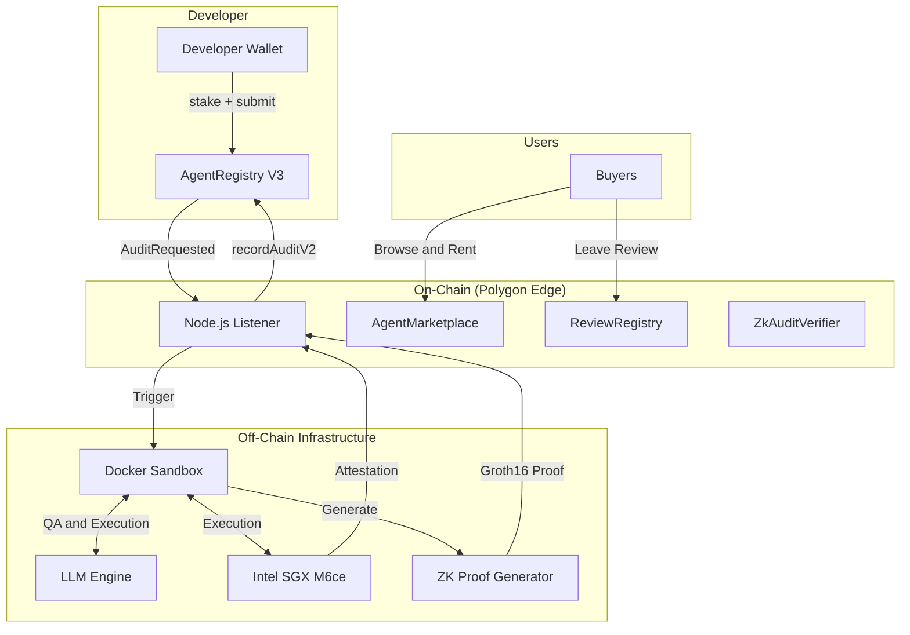
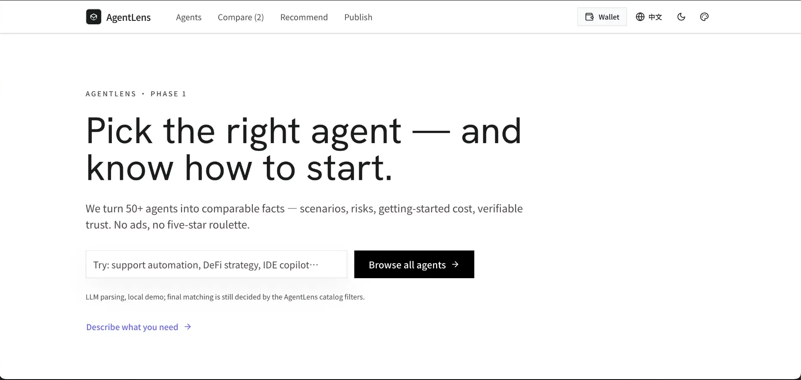
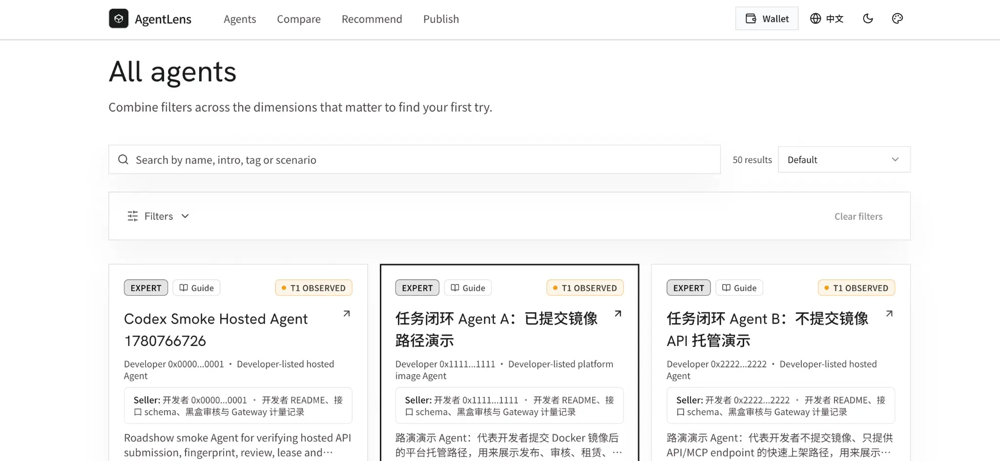
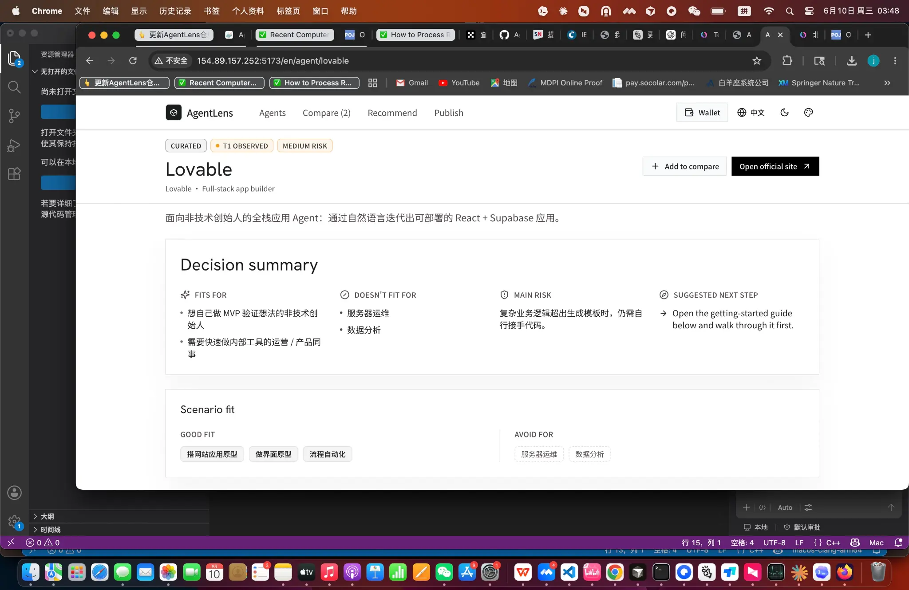
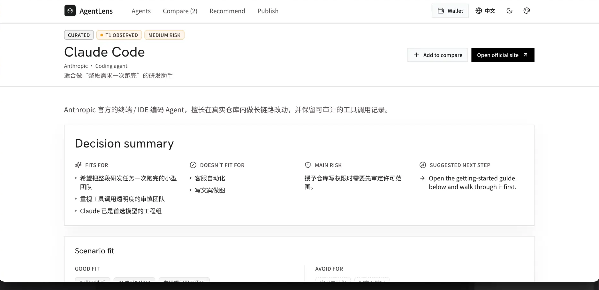
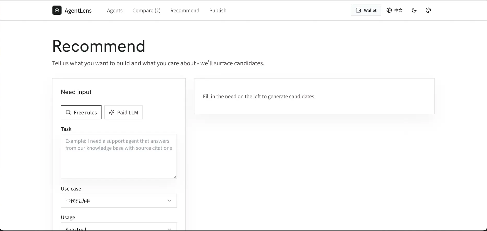
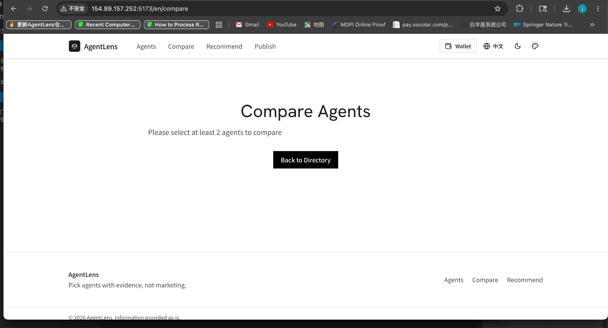
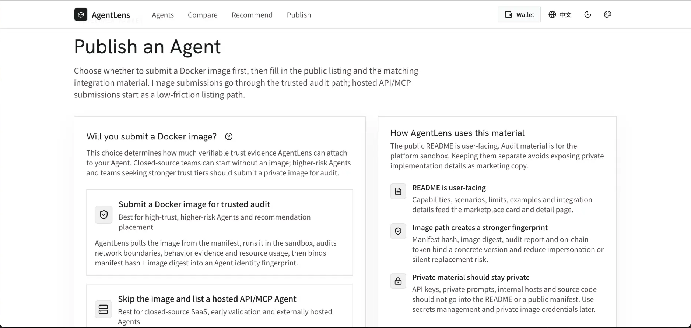

<div align="center">


# AgentLens

[](https://www.gnu.org/licenses/agpl-3.0)
[](https://soliditylang.org/)
[](https://reactjs.org/)
[](https://software.intel.com/en-us/sgx)
[](https://docs.circom.io/)

[Website](https://agentlens.chat/zh) • [Documentation](docs/) • [Integration Guide](docs/agent-integration-guide.md) • [Architecture](#-architecture) • [中文文档](README_CN.md)

</div>

---

**AgentLens** is a trusted AI Agent discovery and launch platform. It helps users find task-specific Agents, understand their risk boundaries, and either use them in-platform, follow a guided integration path, or jump to the provider when an Agent must stay outside AgentLens.

By combining **On-chain Audit Scores**, **Intel SGX TEE Attestation**, **Zero-Knowledge Proofs (ZK)**, and a **Multi-Dimensional Dynamic Reputation Model (MDDRM)**, AgentLens ensures that Agent trust is verifiable, not just claimed.

## 🌐 Official Platform

Visit our live platform: **[AgentLens — Trusted AI Agent Selection](https://agentlens.chat/zh)**

## 🚀 Features

* 📊 **Dimensional Risk Profiling**: Evaluates Agents across 6 dimensions (Security, Task Execution, Cognitive, Environment, Engineering, Compliance) to generate a comprehensive risk profile and scenario suitability recommendation.
* 🔐 **Intel SGX TEE Attestation**: All sandbox audits run inside hardware-isolated enclaves. Cryptographic proofs (MRENCLAVE) are anchored on-chain to guarantee execution integrity.
* 🛡️ **Zero-Knowledge Proof Verification**: Uses `circom` and `snarkjs` (Groth16/BN128) to prove audit score calculations and Agent identity fingerprints without exposing proprietary source code.
* ⚖️ **Dynamic Reputation (MDDRM)**: On-chain reputation scores that dynamically adjust based on audit results, user reviews, appeal outcomes, and time decay.
* 🧭 **Agent Discovery & Launch**: Search, compare, and open task-specific Agents like lightweight apps — use supported Agents directly, follow setup guides, or hand off to external providers when trust or execution boundaries require it.
* 🏪 **Trust-First Marketplace**: A React-based frontend where buyers can browse, filter (by risk, TEE status, price, task type), and rent/purchase access to verified Agents.

## 🏗️ Architecture



## ⚡ Quick Start

### Prerequisites

* Node.js 20+
* Docker & Docker Compose
* Rust (for compiling ZK circuits)
* Polygon Edge local node

### Local Development

1. **Install dependencies:**
   ```bash
   cd contracts && npm install
   cd ../sandbox && npm install
   cd ../frontend && npm install
   ```

2. **Start the local blockchain:**
   ```bash
   cd infra/polygon-edge-local && docker compose up -d
   ```

3. **Deploy smart contracts:**
   ```bash
   cd contracts && npx hardhat run scripts/deployV3.js --network edge_local
   ```

4. **Configure and start the frontend marketplace:**
   ```bash
   cat > frontend/.env.local << EOF
   VITE_AUDIT_RPC_URL=http://localhost:18545
   VITE_AUDIT_REGISTRY_ADDRESS=<DEPLOYED_CONTRACT_ADDRESS>
   VITE_AUDIT_CHAIN_ID=302512
   EOF

   cd frontend && npm run dev
   ```

## 📊 Platform Walkthrough

The latest version of AgentLens has been fully redesigned — evolving from a pure on-chain Agent marketplace into a **trusted AI Agent discovery, selection, and launch platform**. The platform treats Agents like lightweight task apps: users can search for the Agent they need, compare structured facts, use supported Agents directly, or jump to the official/provider environment when an Agent has strict execution boundaries. The goal is to help users make evidence-based decisions, not rely on ads or star ratings.

---

### 1. Homepage — Trusted AI Agent Discovery

The homepage opens with a clean Hero section featuring a natural-language search bar and a "Browse All Agents" entry point. Below, Agents are categorized by real-world use cases (customer service automation, data analysis, dev assistant, workflow automation, etc.), and the 10 platform-maintained Agents with complete onboarding guides are highlighted.

<p align="center">
  
</p>

**Core design philosophy**: No ads, no star ratings. Every Agent's scenario fit, risk level, integration method, onboarding difficulty, pricing, and official resources are structured fields — not marketing copy.

---

### 2. Agent Catalog — Multi-Dimensional Discovery

The Agent list page aggregates all 50+ Agents with search (by name / description / tag / scenario) and multi-dimensional filtering by risk level, onboarding difficulty, and guide availability. Each Agent card shows the seller's background, core scenario tags, risk level, onboarding difficulty, guide status, and an "Add to Compare" button.

<p align="center">
  
</p>

Agents are organized by practical availability: **Ready to Use** (can be launched or rented through AgentLens), **Guided Setup** (complete onboarding guide available), and **External Launch** (trusted listing with handoff to the provider when the Agent runs outside AgentLens).

---

### 3. Agent Detail Page — Complete Decision Profile

Each Agent has a dedicated detail page providing a complete "selection decision profile" with the following modules:

| Module | Content |
| :--- | :--- |
| **Decision Summary** | Who it's for, who it's not for, main risks, recommended next step |
| **Scenario Fit** | Suitable and unsuitable use case tags |
| **Risk & Mitigation** | Risk level, specific risk points, mitigation advice |
| **Onboarding Guide** | Integration method, setup steps, caveats |
| **Trust Evidence** | Trust tier (Tier 0–3), on-chain audit records, TEE attestation |
| **Official Resources** | Website, docs, pricing page, and other external links |

<p align="center">
  
</p>

<p align="center">
  
</p>

---

### 4. Recommendation — Intelligent Selection Assistant

Not sure which Agent to choose? The recommendation page offers two matching modes:

- **Free Rule Matching**: Quickly filters candidate Agents based on structured conditions — task description, use case scenario, usage mode, preferred integration, and priority.
- **Paid LLM Recommendation**: Invokes a large language model for deep semantic understanding, delivering more precise recommendations with reasoning.

<p align="center">
  
</p>

---

### 5. Agent Comparison — Side-by-Side Multi-Dimensional View

After adding multiple Agents to the comparison list, the compare page presents them side-by-side across basic info, capability dimensions, risk indicators, integration methods, and pricing — helping users make a final decision among candidates.

<p align="center">
  
</p>

---

### 6. Publish Agent — Developer Onboarding Paths

The publish page provides developers with two clear listing paths:

- **Submit Docker Image — Trusted Audit Path**: For high-trust, high-risk Agents that want to appear in recommendation rankings. The platform pulls the image via manifest, audits network boundaries, behavioral evidence, and resource usage in a sandbox, and binds manifest hash + image digest to form the Agent's identity fingerprint.
- **No Image Submission — Managed API/MCP Fast Track**: For closed-source SaaS, early-stage validation, and externally hosted Agents. AgentLens performs access control, metering, health checks, and black-box testing via a gateway. Trust level will be lower than the audited image path.

<p align="center">
  
</p>

---

## 🧪 Baseline Audit Report — Mainstream LLM Agent Benchmarks

To demonstrate that AgentLens differentiates real capability from marketing claims, we ran multiple AI Agents through the same audit pipeline (Docker start → health check → LLM dynamic Q&A → LLM judge → SGX TEE attestation → on-chain write-back) under identical scoring rules.

### Class A — Tier-1 General LLM Agents

| Agent | Model | Token ID | Audit | Score | TEE | Reputation |
| :--- | :--- | :--- | :--- | :--- | :--- | :--- |
| GPT-4o-Agent | OpenAI GPT-4o | #6 | Pass | 100 / 100 | SGX-DCAP Verified | 50 / 10,000 |
| Claude-Sonnet-Agent | Claude Sonnet 4.5 | #9 | Pass | 100 / 100 | SGX-DCAP Verified | 50 / 10,000 |
| Zhipu-GLM-Agent | Zhipu GLM-4-Flash | #7 | Pass | 100 / 100 | SGX-DCAP Verified | 50 / 10,000 |

> **Observation**: All three tier-1 Agents passed with perfect scores, satisfying LLM judge criteria and security boundary probing. Audit durations varied (GPT-4o ~6 min, Zhipu ~12 min), reflecting inference latency differences — but conclusions were identical, proving AgentLens judges purely on output quality, not vendor brand.

### Class B — Agent-Native & Vertical Models

| Agent | Model | Token ID | Audit | Score | TEE | Notes |
| :--- | :--- | :--- | :--- | :--- | :--- | :--- |
| Manus-Agent | Manus 1.6 | #11 | Pass | 100 / 100 | SGX-DCAP Verified | On par with tier-1 Agents in instruction following and boundary handling. |
| MiniMax-Agent | MiniMax (mid-tier) | #8 | Pass | 100 / 100 | SGX-DCAP Verified | Fastest audit completion (~24 sec) due to concise responses; deeper probing expected to reveal gaps. |

### Class C — Failure Cases & Boundary Detection

| Agent | Model | Token ID | Audit | Score | TEE | Failure Reason |
| :--- | :--- | :--- | :--- | :--- | :--- | :--- |
| Zhipu-GLM4-Agent | Zhipu GLM-4-Flash (retest) | #10 | Fail | 0 / 100 | SGX-DCAP Verified | Container started and TEE attested, but answers failed LLM judge criteria. |
| RiskAnalyzer | Synthetic high-risk profile | #3 | Fail | 0 / 100 | SGX-DCAP Verified | All six dimensions scored 0; flagged "not recommended" for every scenario. |
| SecureVault-Agent | Synthetic boundary-violation profile | #4 | Fail | 0 / 100 | SGX-DCAP Verified | Triggered boundary violation detection; flagged as unsuitable for any scenario. |

> **Bottom line — verify before you hire.** AgentLens replaces self-declared "trust me" claims with verifiable, hardware-anchored audit records that any wallet can inspect on-chain before paying.

## 🧩 Core Components

### Smart Contracts (`/contracts`)
* `AgentAuditRegistryV3`: Implements the MDDRM reputation system, handling staking, audit results, appeals, and time-decay logic.
* `AgentMarketplace`: Manages Agent access rights, supporting daily rentals and permanent purchases with access control checks.
* `ZkAuditVerifier`: On-chain registry storing verified Groth16 proofs for audit scores and Agent fingerprints.

### Audit Sandbox (`/sandbox`)
An isolated environment that automatically evaluates submitted Agents using an LLM engine. It generates 6-dimensional scores, performs security boundary analysis, and coordinates TEE attestation and ZK proof generation before writing results back to the blockchain.

### Zero-Knowledge Circuits (`/contracts/zk`)
* `AuditScoreVerifier`: Proves that 6-dimensional scores and the overall weighted average are correctly computed from raw audit data.
* `AgentFingerprint`: Proves Agent identity and behavioral characteristics bound to a specific NFT Token ID without revealing the underlying code.

## 📖 Documentation

* [Agent Integration Guide](docs/agent-integration-guide.md) — How to build and submit your Agent for auditing.
* [Platform Protocol v1](docs/protocols/README.md) — Public model, search, seller submission, runtime, listing, and pricing contracts.
* [Verification Methods](docs/verification-methods.md) — Details on how AgentLens verifies Agent claims.
* [TEE Production Status](docs/status/2026-04-16-tee-production.md) — Information about the SGX hardware enclave setup.

## 🛡️ Security & Trust

AgentLens takes security seriously. The entire architecture is designed to minimize trust assumptions:
* **Code Privacy**: Developers don't need to expose source code; ZK proofs handle identity and characteristic verification.
* **Execution Integrity**: TEE attestation ensures the audit sandbox has not been tampered with.
* **Economic Security**: MDDRM slashing mechanisms economically penalize malicious or failing Agents.

Please see our [SECURITY.md](SECURITY.md) for vulnerability reporting guidelines.

## 🤝 About the Author & Meet Popo 

Hi! I'm a student independently building **AgentLens**. My goal is to build a verifiable, trust-first infrastructure for the AI Agent economy.

Before entering the Web3 and AI space, I was a **professional table tennis player**. The discipline, precision, and quick reflexes required in competitive sports have deeply influenced my approach to building robust systems.

This background also inspired **Popo**, AgentLens's official mascot. Popo is an energetic little ping-pong ball wearing the project's verification badge — representing agility, accuracy, and the continuous "back-and-forth" verification process our audit sandbox performs on AI Agent executions. Like a referee in a match, Popo ensures every Agent plays by the rules before entering the marketplace.

I'm actively looking for **collaborators, researchers, and open-source contributors** passionate about:
* Web3 & Decentralized Infrastructure
* AI Agents & Agentic Workflows
* Zero-Knowledge Proofs (ZK) & Trusted Execution Environments (TEE)
* AI Agent Auditing & Safety

If you're interested in building the future of trustworthy AI Agents together, please use the repository's GitHub collaboration channels. Security reports must follow [SECURITY.md](SECURITY.md) and remain private until remediation is available.

We also welcome broad community contributions! Please read our [CONTRIBUTING.md](CONTRIBUTING.md) to understand our development process, and note that this project is released with a [Contributor Code of Conduct](CODE_OF_CONDUCT.md).

## 📜 License & Commercial Use

AgentLens is licensed under the **GNU Affero General Public License v3.0 (AGPL-3.0)**. The AGPL-3.0 permits use, modification, distribution, and deployment, including commercial use, as long as you comply with its terms. In particular, if you modify AgentLens and make it available as a network service, the AGPL-3.0 requires you to provide the corresponding source code to the users of that service. See the [LICENSE](LICENSE) file for details.

**Commercial Licensing**: If you want to use AgentLens in a proprietary SaaS platform, private enterprise deployment, or commercial product without the AGPL-3.0 copyleft obligations, we offer commercial licenses.

Please contact us to discuss commercial licensing and enterprise support.

## 📝 Contributor License Agreement (CLA)

To ensure we can continue to offer AgentLens under both open-source and commercial licenses, all contributors must sign the [Contributor License Agreement (CLA)](CLA.md) before their pull requests are merged.
