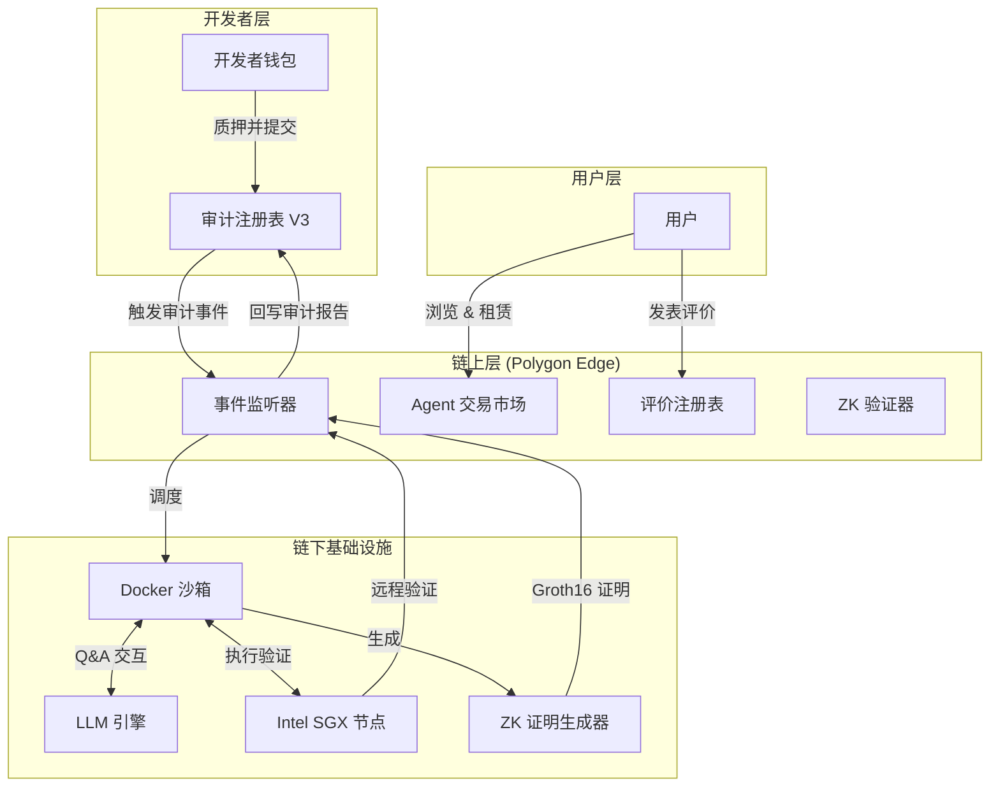
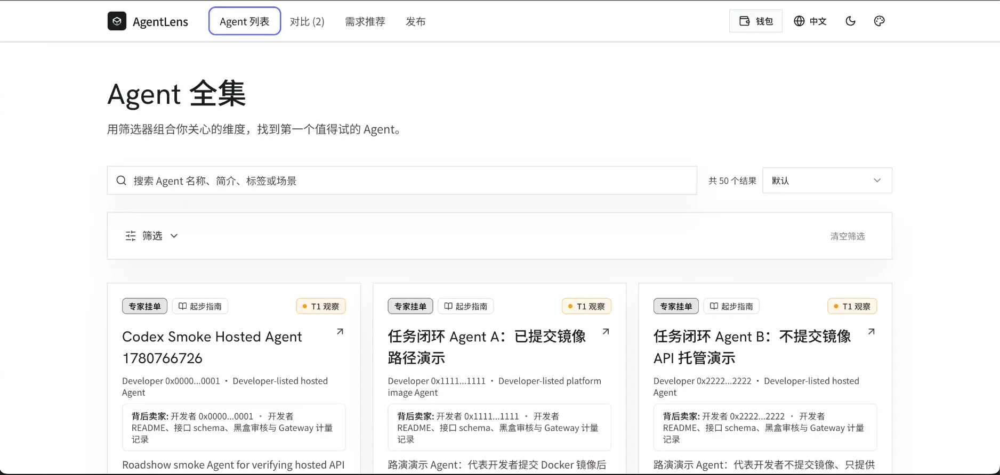
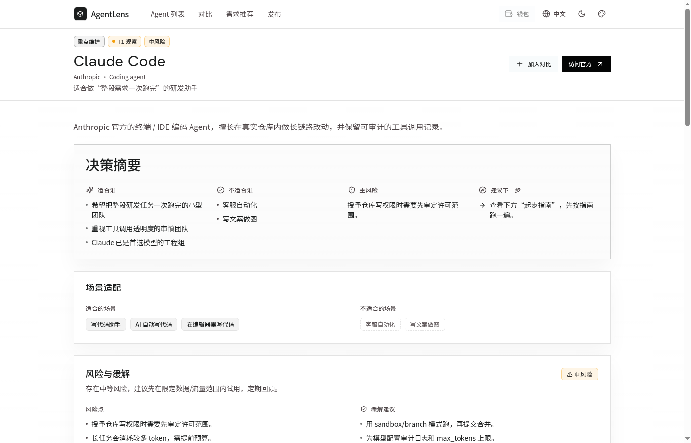
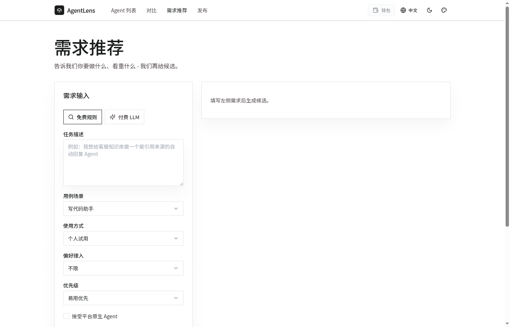
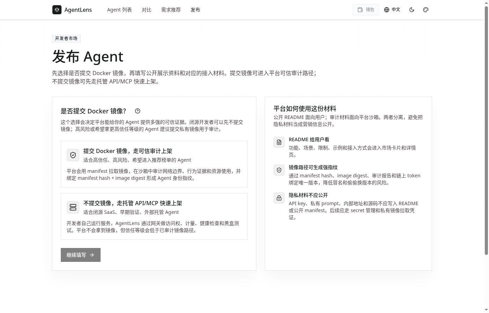

<div align="center">


# AgentLens

[](https://www.gnu.org/licenses/agpl-3.0)
[](https://soliditylang.org/)
[](https://reactjs.org/)
[](https://software.intel.com/en-us/sgx)
[](https://docs.circom.io/)

[官方网站](http://[redacted-server]:5173/zh) • [项目文档](docs/) • [Agent 接入指南](docs/agent-integration-guide.md) • [架构详解](#-系统架构) • [English](README.md)

</div>

---

**AgentLens** 是一个去中心化的基础设施与可信 AI Agent 导航平台，旨在解决 AI Agent 经济中的信任难题。在您雇佣或与 AI Agent 交互之前，AgentLens 将其能力、安全边界和历史表现转化为可验证的结构化事实。

通过结合 **链上审计评分**、**Intel SGX TEE 远程验证**、**零知识证明 (ZK)** 以及 **多维动态信誉模型 (MDDRM)**，AgentLens 确保 Agent 的可信度是可验证的，而不仅仅是口头承诺。

## 🌐 官方平台

访问我们的在线平台：**[AgentLens — 可信 AI Agent 导航](http://[redacted-server]:5173/zh)**

## 🚀 核心特性

* 📊 **多维风险画像**：从安全、任务执行、认知、环境、工程、合规 6 个维度评估 Agent，生成详尽的风险画像和场景适配建议。
* 🔐 **Intel SGX TEE 存证**：所有沙箱审计均在硬件隔离的环境中运行。加密证明（MRENCLAVE）锚定在链上，确保执行过程不可篡改。
* 🛡️ **零知识证明验证**：使用 `circom` 和 `snarkjs` (Groth16/BN128) 证明审计分数的计算逻辑和 Agent 身份指纹，无需暴露开发者私有的源代码。
* ⚖️ **动态信誉系统 (MDDRM)**：链上信誉分根据审计结果、用户评价、申诉结果和时间衰减动态调整。
* 🏪 **可信导航市场**：基于 React 的前端平台，聚合 50+ 主流 AI Agent，按场景适配、风险等级、接入方式等结构化维度帮助用户做出有据可查的决策。

## 🏗️ 系统架构



## ⚡ 快速开始

### 环境要求

* Node.js 20+
* Docker & Docker Compose
* Rust（用于 ZK 电路编译）
* Polygon Edge 本地节点

### 本地开发

1. **安装依赖：**
   ```bash
   cd contracts && npm install
   cd ../sandbox && npm install
   cd ../frontend && npm install
   ```

2. **启动本地区块链：**
   ```bash
   cd infra/polygon-edge-local && docker compose up -d
   ```

3. **部署智能合约：**
   ```bash
   cd contracts && npx hardhat run scripts/deployV3.js --network edge_local
   ```

4. **配置并启动前端：**
   ```bash
   cat > frontend/.env.local << EOF
   VITE_AUDIT_RPC_URL=http://localhost:18545
   VITE_AUDIT_REGISTRY_ADDRESS=<DEPLOYED_CONTRACT_ADDRESS>
   VITE_AUDIT_CHAIN_ID=302512
   EOF

   cd frontend && npm run dev
   ```

## 📊 平台功能展示

AgentLens 最新版本已完成全面重构——从纯链上 Agent 交易市场演进为**可信 AI Agent 导航与选型平台**。平台聚合了 50+ 主流 AI Agent，将每个 Agent 拆解为可对比的结构化事实：场景适配、风险等级、接入方式、上手成本以及是否经过可验证的信任审计。目标是帮助用户基于证据做决策，而非依赖广告或五星好评。

---

### 1. 首页 — 可信 AI Agent 发现

首页以简洁的 Hero 区域开场，提供自然语言搜索栏和"浏览全部 Agent"入口。下方按真实使用场景（客服自动化、数据分析、开发助手、流程自动化等）对 Agent 进行分类，并重点展示平台精心维护、配有完整上手指南的 10 个 Agent。

<p align="center">
  
</p>

**核心设计理念**：无广告、无星级评分。每个 Agent 的场景适配、风险等级、接入方式、上手难度、定价和官方资源均为结构化字段，而非营销文案。

---

### 2. Agent 全集 — 多维度发现

Agent 列表页聚合了全部 50+ Agent，支持按名称 / 简介 / 标签 / 场景搜索，以及按风险等级、上手难度、指南完整度进行多维筛选。每张 Agent 卡片展示开发者背景、核心场景标签、风险等级、上手难度、指南状态和"加入对比"按钮。

<p align="center">
  
</p>

Agent 分为三种标签类型：**专家挂单**（真实从业者背书）、**T1 观察**（主流商业 Agent）和 **T0 精选**（平台深度维护），帮助用户快速评估信息来源的可信度。

---

### 3. Agent 详情页 — 完整决策档案

每个 Agent 都有专属详情页，提供完整的"选型决策档案"，包含以下模块：

| 模块 | 内容 |
| :--- | :--- |
| **决策摘要** | 适合谁、不适合谁、主要风险、建议下一步 |
| **场景适配** | 适合和不适合的使用场景标签 |
| **风险与缓解** | 风险等级、具体风险点、缓解建议 |
| **上手指南** | 接入方式、配置步骤、注意事项 |
| **信任证据** | 信任层级（T0–T3）、链上审计记录、TEE 存证 |
| **官方资源** | 官网、文档、定价页及其他外部链接 |

<p align="center">
  
</p>

<p align="center">
  
</p>

---

### 4. 需求推荐 — 智能选型助手

不确定选哪个 Agent？推荐页提供两种匹配模式：

- **免费规则匹配**：根据任务描述、使用场景、使用方式、偏好接入方式和优先级等结构化条件快速筛选候选 Agent。
- **付费 LLM 推荐**：调用大语言模型进行深度语义理解，提供更精准的推荐结果和推理说明。

<p align="center">
  
</p>

---

### 5. Agent 对比 — 多维并排视图

将多个 Agent 加入对比列表后，对比页将从基本信息、能力维度、风险指标、接入方式和定价等方面并排展示，帮助用户在候选 Agent 中做出最终决策。

<p align="center">
  
</p>

---

### 6. 发布 Agent — 开发者接入路径

发布页为开发者提供两条清晰的上架路径：

- **提交 Docker 镜像 — 可信审计路径**：适合希望进入推荐排名的高信任、高风险 Agent。平台通过 manifest 拉取镜像，在沙箱中审计网络边界、行为证据和资源使用情况，并将 manifest hash + 镜像 digest 绑定形成 Agent 身份指纹。
- **不提交镜像 — 托管 API/MCP 快速上架**：适合闭源 SaaS、早期验证阶段和外部托管的 Agent。AgentLens 通过网关进行访问控制、计量、健康检查和黑盒测试。信任层级低于审计镜像路径。

<p align="center">
  
</p>

---

## 🧪 基准审计报告 — 主流 LLM Agent 评测

为证明 AgentLens 能区分真实能力与营销宣传，我们在相同评分规则下对多个 AI Agent 运行了同一套审计流程（Docker 启动 → 健康检查 → LLM 动态问答 → LLM 裁判 → SGX TEE 存证 → 链上回写）。

### A 类 — 一线通用 LLM Agent

| Agent | 模型 | Token ID | 审计结果 | 评分 | TEE | 信誉分 |
| :--- | :--- | :--- | :--- | :--- | :--- | :--- |
| GPT-4o-Agent | OpenAI GPT-4o | #6 | 通过 | 100 / 100 | SGX-DCAP 已验证 | 50 / 10,000 |
| Claude-Sonnet-Agent | Claude Sonnet 4.5 | #9 | 通过 | 100 / 100 | SGX-DCAP 已验证 | 50 / 10,000 |
| Zhipu-GLM-Agent | 智谱 GLM-4-Flash | #7 | 通过 | 100 / 100 | SGX-DCAP 已验证 | 50 / 10,000 |

> **观察**：三个一线 Agent 均以满分通过，满足 LLM 裁判标准和安全边界探测。审计耗时有所差异（GPT-4o 约 6 分钟，智谱约 12 分钟），反映了推理延迟的差异——但结论一致，证明 AgentLens 纯粹基于输出质量评判，而非供应商品牌。

### B 类 — Agent 原生与垂直模型

| Agent | 模型 | Token ID | 审计结果 | 评分 | TEE | 备注 |
| :--- | :--- | :--- | :--- | :--- | :--- | :--- |
| Manus-Agent | Manus 1.6 | #11 | 通过 | 100 / 100 | SGX-DCAP 已验证 | 指令遵循和边界处理与一线 Agent 持平。 |
| MiniMax-Agent | MiniMax（中端） | #8 | 通过 | 100 / 100 | SGX-DCAP 已验证 | 审计完成最快（约 24 秒），因回答简洁；更深层探测预计会暴露差距。 |

### C 类 — 失败案例与边界检测

| Agent | 模型 | Token ID | 审计结果 | 评分 | TEE | 失败原因 |
| :--- | :--- | :--- | :--- | :--- | :--- | :--- |
| Zhipu-GLM4-Agent | 智谱 GLM-4-Flash（复测） | #10 | 失败 | 0 / 100 | SGX-DCAP 已验证 | 容器启动并完成 TEE 存证，但回答未通过 LLM 裁判标准。 |
| RiskAnalyzer | 合成高风险画像 | #3 | 失败 | 0 / 100 | SGX-DCAP 已验证 | 六个维度全部得 0 分；在所有场景中均被标记为"不推荐"。 |
| SecureVault-Agent | 合成边界违规画像 | #4 | 失败 | 0 / 100 | SGX-DCAP 已验证 | 触发边界违规检测；被标记为不适合任何场景。 |

> **结论 — 雇用前先验证。** AgentLens 用可验证的、硬件锚定的审计记录取代了自我声明的"相信我"，任何钱包地址都可以在付款前在链上查阅。

## 🧩 核心组件

### 智能合约（`/contracts`）
* `AgentAuditRegistryV3`：实现 MDDRM 信誉系统，处理质押、审计结果、申诉和时间衰减逻辑。
* `AgentMarketplace`：管理 Agent 访问权限，支持按日租赁和永久购买，并进行访问控制检查。
* `ZkAuditVerifier`：链上注册表，存储审计分数和 Agent 指纹的已验证 Groth16 证明。

### 审计沙箱（`/sandbox`）
一个隔离环境，使用 LLM 引擎自动评估提交的 Agent。生成 6 维评分、执行安全边界分析，并在将结果写回区块链前协调 TEE 存证和 ZK 证明生成。

### 零知识电路（`/contracts/zk`）
* `AuditScoreVerifier`：证明 6 维评分和整体加权平均值是从原始审计数据中正确计算得出的。
* `AgentFingerprint`：证明 Agent 身份和行为特征与特定 NFT Token ID 绑定，无需暴露底层代码。

## 📖 文档

* [Agent 接入指南](docs/agent-integration-guide.md) — 如何构建并提交您的 Agent 进行审计。
* [验证方法说明](docs/verification-methods.md) — AgentLens 如何验证 Agent 声明的详细说明。
* [TEE 生产状态](docs/status/2026-04-16-tee-production.md) — SGX 硬件飞地配置信息。

## 🛡️ 安全与信任

AgentLens 将安全性放在首位。整个架构旨在最小化信任假设：
* **代码隐私**：开发者无需暴露源代码；ZK 证明负责身份和特征验证。
* **执行完整性**：TEE 存证确保审计沙箱未被篡改。
* **经济安全**：MDDRM 惩罚机制对恶意或失败的 Agent 进行经济处罚。

漏洞报告请参阅 [SECURITY.md](SECURITY.md)。

## 🤝 关于作者 & 认识 Popo 

你好！我是一名独立构建 **AgentLens** 的学生。我的目标是为 AI Agent 经济构建一个可验证的、以信任为先的基础设施。

在进入 Web3 和 AI 领域之前，我曾是一名**职业乒乓球运动员**。竞技体育所要求的纪律性、精准度和快速反应，深刻影响了我构建健壮系统的方式。

这段经历也启发了 **Popo** 的诞生——AgentLens 的官方吉祥物。Popo 是一个活力十足的小乒乓球，佩戴着项目的验证徽章，代表着敏捷、精准，以及我们的审计沙箱对 AI Agent 执行过程持续进行的"来回"验证。就像比赛中的裁判，Popo 确保每个 Agent 在进入市场之前都遵守规则。

我正在积极寻找对以下领域充满热情的**合作者、研究者和开源贡献者**：
* Web3 与去中心化基础设施
* AI Agent 与 Agentic 工作流
* 零知识证明 (ZK) 与可信执行环境 (TEE)
* AI Agent 审计与安全

如果您有兴趣共同构建可信 AI Agent 的未来，欢迎联系！
**联系方式：** [3172791717@qq.com](mailto:3172791717@qq.com)

我们也欢迎广泛的社区贡献！请阅读 [CONTRIBUTING.md](CONTRIBUTING.md) 了解我们的开发流程，并注意本项目附有[贡献者行为准则](CODE_OF_CONDUCT.md)。

## 📜 许可证与商业使用

AgentLens 以 **GNU Affero 通用公共许可证 v3.0 (AGPL-3.0)** 开源，供社区、研究和非商业用途使用。详情请参阅 [LICENSE](LICENSE) 文件。

**商业许可**：如需在商业产品中使用 AgentLens，请通过 [3172791717@qq.com](mailto:3172791717@qq.com) 联系我们获取商业许可协议。

## 📝 贡献者许可协议 (CLA)

为保护项目和贡献者双方的权益，所有贡献者在提交 Pull Request 之前必须签署我们的[贡献者许可协议](CLA.md)。

CLA 确保：
* 您保留对贡献内容的版权
* AgentLens 获得在项目中使用您贡献内容的必要权利
* 项目可以在未来根据需要进行再许可（例如，用于商业许可）

---

<div align="center">

由 AgentLens 团队用 ❤️ 构建

[官方网站](http://[redacted-server]:5173/zh) • [GitHub](https://github.com/ZhangJinHaHaHa/AgentLens) • [联系我们](mailto:3172791717@qq.com)

</div>
