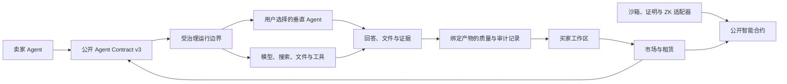

<div align="center">


# AgentLens

[](https://www.gnu.org/licenses/agpl-3.0)
[](https://soliditylang.org/)
[](https://react.dev/)
[](docs/protocols/README.md)

## [打开 AgentLens](https://agentlens.chat/zh)

[在线平台](https://agentlens.chat/zh) • [公开协议](docs/protocols/README.md) • [Agent 接入指南](docs/agent-integration-guide.md) • [安全策略](SECURITY.md) • [English](README.md)

</div>

---

**AgentLens** 是一个以信任为先的 AI Agent 市场与工作区。用户可以发现垂直 Agent、比较证据和执行边界、租赁可运行的 Agent，并让它使用平台提供的模型、搜索、文件、产物和审计能力完成任务。

平台遵循一个清晰边界：**AgentLens 提供大脑和受治理的运行环境，卖家提供垂直 Agent。** 租赁获得的是限时运行权，不包含源码转让或永久所有权。

> 本仓库是经过脱敏的公开源码版本，包含公开产品界面、智能合约、接入协议和非敏感审计参考代码。托管 Brain 策略、生产路由、Worker、能力代理策略、质量评分、计费账本、凭据、拓扑和部署自动化保留在私有系统中。

## 公开内容

- **市场与决策界面**：浏览、对比、查看信任证据并理解 Agent 的使用方式。
- **纯租赁智能合约**：限时访问、评价、审计记录、申诉与信誉基础能力。
- **审计参考实现**：六维评估、证据持久化、证明适配器和 ZK 验证组件。
- **Agent Contract v3 与 Wire v1**：任务、流式事件、工具、检查点、取消、恢复、产物和结构化失败。
- **Provider 契约**：模型、搜索、研究包、来源映射和一致性报告的统一格式。
- **Runtime 契约**：不可变运行包、能力授权和 R0-R4 运行平面描述。

协议公开让第三方能够接入、复现和安全评审，同时不暴露生产凭据和平台的核心编排、风控与结算实现。

## 架构边界



该图描述公开的信任边界，不代表生产网络拓扑。

## Runtime 契约覆盖

| 层级 | 运行平面 | 用途 | 当前口径 |
|---|---|---|---|
| R0 | `sealed_ephemeral` | 隔离、短时的文件和产物任务 | 基础合同 |
| R1 | `brokered_egress` | 受治理的 HTTP、搜索和连接器访问 | 受权限与预算控制 |
| R2 | `durable_session` | 检查点、恢复、持久卷和长任务 | 按生命周期计量 |
| R3 | `browser_computer` | 只读或交互式浏览器会话 | 独立隔离并逐项授权 |
| R4 | `accelerated_external` | GPU、特殊操作系统和超大存储 | 协议预留；极重型任务暂缓接入 |

Schema 能描述某项能力，不代表每个部署都已提供相应资源。Agent 上架前必须通过运行一致性检查；不支持的能力必须失败关闭，不能静默降级或假装成功。

## 快速开始

### 环境要求

- Node.js 20+
- npm 10+
- Docker 仅用于容器审计实验

### 安装与验证

```bash
git clone https://github.com/ZhangJinHaHaHa/AgentLens.git
cd AgentLens

cd contracts && npm install && npm test
cd ../sandbox && npm install && npm test
cd ../frontend && npm install && npm test && npm run build
```

### 本地运行公开前端

```bash
cd frontend
npm run dev
```

公开界面无需生产密钥即可浏览。依赖托管 Provider、认证卖家账号或平台运行时的功能，在独立克隆中会按设计保持不可用。

## 产品界面

### 发现和对比 Agent

目录将可运行的 Agent 市场与外部 AI 工具指南彻底分开，并用结构化字段呈现场景、执行方式、风险、证据和下一步建议。

<p align="center">
  
</p>

### 查看信任与运行边界

Agent 详情页区分平台原生审计执行、卖家托管 API 和外部跳转。被收录或被识别不等于已经获得平台沙箱担保。

<p align="center">
  
</p>

### 按明确路径发布

卖家可以提交代码材料交由平台处理，也可以注册卖家托管的 HTTPS API。两条路径拥有不同的证据和信任声明；仅 API 上架不会继承源码审计结论。

<p align="center">
  
</p>

## 公开接入协议

机器可读 Schema 位于 [`docs/protocols/schemas`](docs/protocols/schemas)：

- Agent Contract v3、Agent Wire v1 与不可变 Runtime Package v1
- Universal Runtime 运行平面、能力授权和外部资源回执
- Model Provider、内容部件和一致性报告
- Search Provider 与 Research Bundle v3
- 产物到证据来源的映射
- 卖家提交、托管运行、市场商品和报价快照

版本规则、凭据边界、R0-R4 语义和租赁计价详见[协议索引](docs/protocols/README.md)。

## 安全与证据

- 平台和卖家凭据必须仅保存在服务端，不能进入 Wire 帧、浏览器包、运行 trace 或交付产物。
- 卖家端点和网络调用必须执行抗 SSRF 校验、解析地址检查、超时、响应大小限制和授权。
- 审计证据绑定具体版本和内容哈希。TEE 或 ZK 适配器可以增强单条记录，但必须逐条验证，不能从普通商品标签推定。
- 历史或 mock 证明不代表生产硬件证明。
- 卖家 QA 只是输入证据，不等于市场质量通过；平台质量记录必须指向具体产物和运行版本。

漏洞请按 [SECURITY.md](SECURITY.md) 私密报告。修复可用前请勿公开利用细节。

## 公开与私有边界

| 本仓库公开 | 托管服务保留 |
|---|---|
| 公开前端和目录 | 工作区控制面与私有管理界面 |
| 智能合约和 ABI | 生产地址、签名账户和链上运维 |
| 协议 Schema 与 OpenAPI | Brain 提示词、路由算法和 Provider 权重 |
| 非敏感沙箱与验证代码 | 生产 Worker、队列与能力代理实现 |
| 本地测试和一致性样例 | QA 评分、计费账本与结算对账逻辑 |
| 通用接入文档 | 基础设施拓扑、部署脚本、密钥和运行状态 |

这条边界是有意设计的：第三方 Agent 获得稳定、可评审的接入合同，同时平台的运行安全和核心编排得到保护。

## 文档

- [公开接入协议](docs/protocols/README.md)
- [Agent 接入指南](docs/agent-integration-guide.md)
- [验证方法](docs/verification-methods.md)
- [安全策略](SECURITY.md)
- [贡献指南](CONTRIBUTING.md)

## 许可证与贡献

AgentLens 采用 **GNU Affero 通用公共许可证 v3.0（AGPL-3.0）**。将修改后的 AGPL 代码作为网络服务提供时，需要遵守 [LICENSE](LICENSE) 中的对应源码义务。闭源商业使用可与仓库所有者另行沟通商业许可。

贡献者需要遵守[贡献者行为准则](CODE_OF_CONDUCT.md)，并在 Pull Request 合并前签署[贡献者许可协议](CLA.md)。

<div align="center">

由 AgentLens 项目构建

[打开 AgentLens](https://agentlens.chat/zh) • [GitHub](https://github.com/ZhangJinHaHaHa/AgentLens) • [安全报告](SECURITY.md)

</div>
